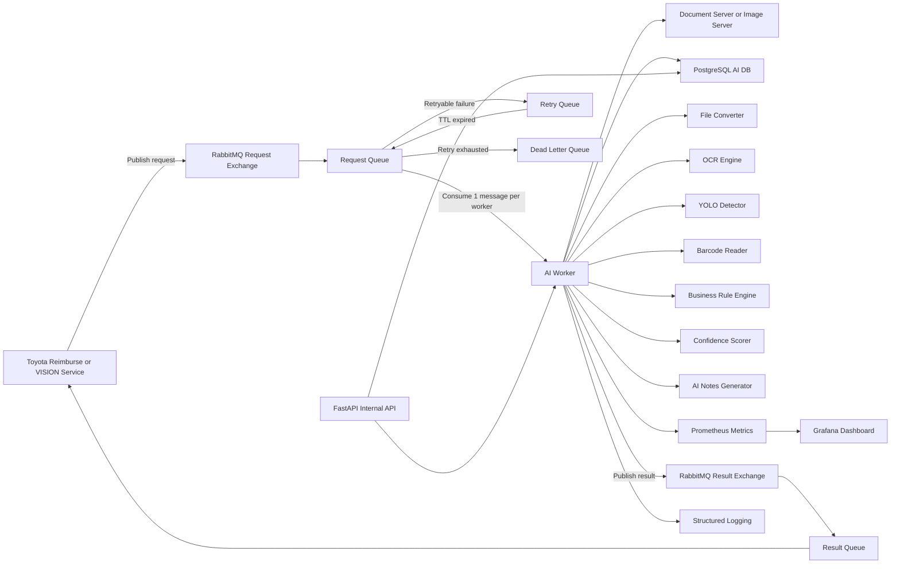
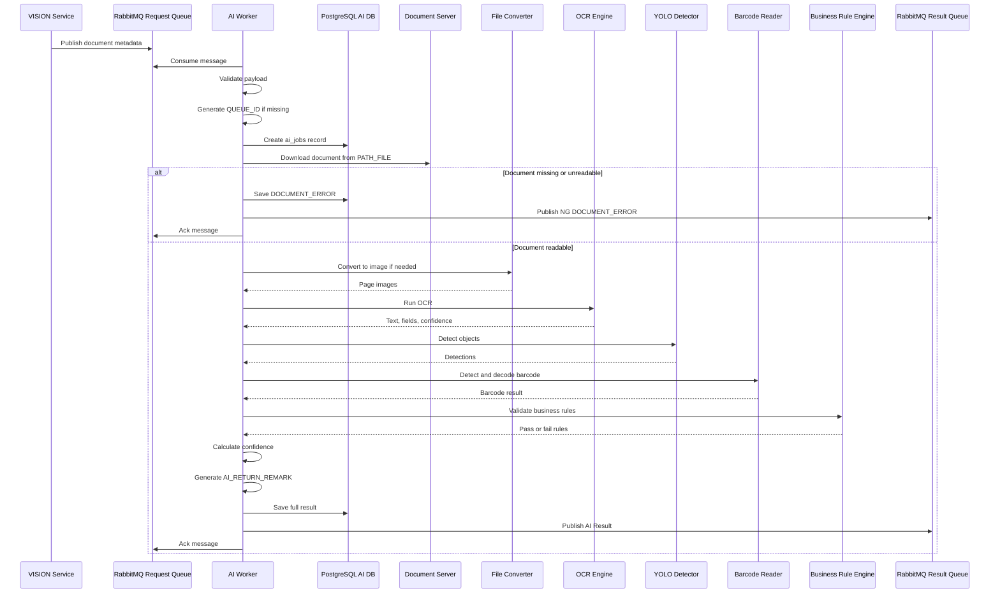
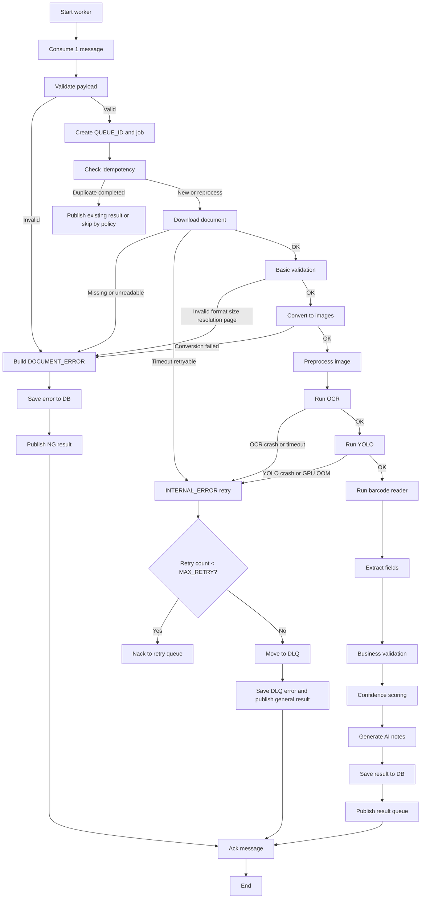
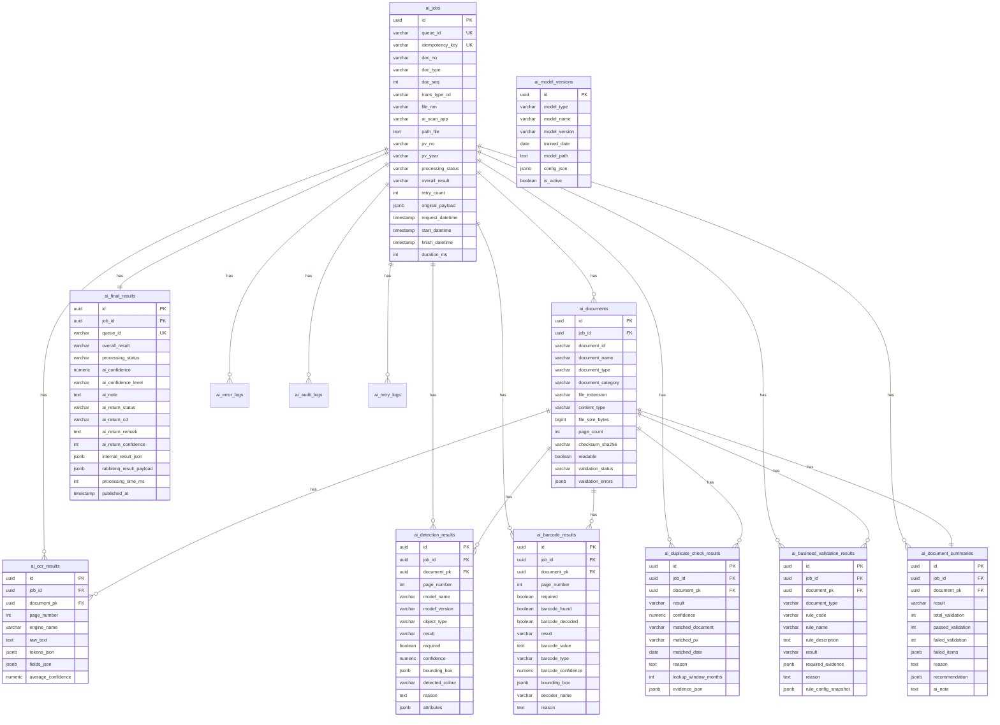

# PRD.md - AI Invoice Verification Agent Service

## 1. Product Overview

### 1.1 Latar belakang

Toyota memiliki proses reimburse, invoice verification, validasi pembelian, dan payment yang membutuhkan pemeriksaan dokumen secara konsisten. Dokumen invoice dan dokumen pendukung dapat memiliki format, kualitas scan, struktur layout, dan kelengkapan bukti yang berbeda. Pemeriksaan manual oleh AP Staff tetap penting, tetapi proses awal dapat dipercepat dengan AI Agent Service.

AI Agent Service adalah service terpisah dari Toyota Reimburse/VISION Service. Service ini menerima message dari RabbitMQ, mengambil dokumen dari `PATH_FILE`, melakukan OCR, object detection, barcode detection, parsing field, business validation, confidence scoring, lalu mengirim hasil kembali melalui RabbitMQ.

### 1.2 Tujuan produk

Tujuan produk ini adalah membangun AI Agent Service berbasis Python dengan Clean Architecture untuk memverifikasi dokumen E-Invoice secara otomatis dan terukur.

Tujuan utama:

1. Mengambil dokumen dari URL atau path server yang dikirim melalui RabbitMQ.
2. Memvalidasi kelayakan teknis dokumen.
3. Mengekstrak teks penting melalui OCR.
4. Mendeteksi materai, stamp, tanda tangan, dan barcode.
5. Mengekstrak invoice number, billing number, dan amount.
6. Menjalankan rule bisnis yang dapat dikonfigurasi.
7. Menghasilkan status `OK` atau `NG` dengan confidence score.
8. Menyimpan seluruh proses ke database AI.
9. Mengirim AI Result ke RabbitMQ result queue.
10. Mendukung retry, DLQ, audit trail, observability, dan reprocess.

### 1.3 Masalah yang diselesaikan

| Masalah | Dampak | Solusi dari AI Agent Service |
|---|---|---|
| Pemeriksaan invoice membutuhkan waktu | Payment dapat tertunda | AI melakukan validasi awal secara otomatis |
| Dokumen tidak konsisten | AP Staff perlu cek ulang banyak format | OCR dan parsing field berbasis rule dan layout |
| Stamp, materai, dan signature sering terlewat | Risiko payment atas dokumen tidak lengkap | YOLO mendeteksi object wajib |
| Barcode belum selalu terbaca | Validasi dokumen belum lengkap | Barcode reader fallback dan roadmap YOLO barcode |
| Error dokumen tidak terdokumentasi rapi | Sulit audit dan tracing | Error classification, DB log, dan AI notes |
| Message broker dapat menghasilkan duplicate message | Data ganda dan result ganda | Idempotency key berbasis metadata dokumen |
| Model AI dapat gagal karena GPU atau timeout | Worker berhenti atau message hilang | Retry, DLQ, graceful error handling |

### 1.4 Nilai bisnis untuk Toyota

1. Mempercepat proses invoice verification sebelum payment.
2. Mengurangi beban pemeriksaan awal oleh AP Staff.
3. Menurunkan risiko dokumen tidak lengkap diproses ke tahap payment.
4. Meningkatkan traceability proses validasi dokumen.
5. Menyediakan data audit atas OCR, detection, confidence, dan rule failure.
6. Membantu proses D-1 sebelum payment day dengan validasi dokumen yang lebih cepat.
7. Mendukung review manual berbasis AI notes yang mudah dipahami.

### 1.5 Ringkasan cara kerja service

1. VISION Service mengirim message ke RabbitMQ request queue.
2. AI Worker mengambil satu message.
3. AI Worker membuat `QUEUE_ID` jika belum dikirim upstream.
4. AI Worker membuat record awal di PostgreSQL AI DB.
5. AI Worker mengambil file dari `PATH_FILE`.
6. AI Worker memvalidasi format, ukuran, resolusi, dan jumlah halaman.
7. AI Worker menjalankan OCR, YOLO, dan barcode reader.
8. AI Worker mengekstrak field bisnis.
9. AI Worker menjalankan rule validation.
10. AI Worker menghitung confidence.
11. AI Worker membuat AI notes dan final result.
12. AI Worker menyimpan hasil ke database.
13. AI Worker publish result ke RabbitMQ result queue.
14. AI Worker melakukan ack message jika proses selesai.
15. AI Worker melakukan nack atau DLQ jika error retryable dan retry habis.

### 1.6 Hubungan AI Service dengan Toyota Reimburse/VISION Service

AI Agent Service tidak menggantikan VISION Service. AI Agent Service hanya menjadi service pendukung untuk memproses dokumen dengan AI.

| Komponen | Tanggung jawab |
|---|---|
| Toyota Reimburse/VISION Service | Menyediakan dokumen, mengirim request, menerima AI Result, menentukan workflow payment |
| AI Agent Service | OCR, detection, validation, scoring, notes, result publishing |
| AP Staff | Melakukan review manual jika AI Result `NG`, confidence rendah, atau manual review diaktifkan |
| RabbitMQ | Message transport untuk request, result, retry, dan DLQ |
| PostgreSQL AI DB | Menyimpan job, dokumen, output model, error, audit, dan final result |

---

## 2. Business Context

### 2.1 Posisi dalam proses reimburse dan payment

AI Agent Service digunakan pada tahap validasi dokumen sebelum proses reimburse atau payment dilanjutkan. Service ini cocok ditempatkan setelah dokumen masuk ke VISION Service dan sebelum AP Staff membuat keputusan final atau sebelum dokumen masuk ke payment queue.

Alur bisnis yang disarankan:

1. User atau sistem internal mengajukan reimburse atau invoice.
2. VISION Service menyimpan dokumen ke document server.
3. VISION Service mengirim metadata dokumen ke RabbitMQ.
4. AI Agent Service memproses dokumen.
5. AI Agent Service mengembalikan `AI_RETURN_STATUS`, `AI_RETURN_CD`, `AI_RETURN_REMARK`, dan `AI_RETURN_CONFIDENCE`.
6. VISION Service menampilkan hasil AI kepada AP Staff.
7. AP Staff melanjutkan, menolak, atau melakukan manual verification.
8. Sistem payment melanjutkan proses hanya jika aturan internal terpenuhi.

### 2.2 Keterkaitan dengan E-Invoice Verification

AI Agent Service memverifikasi elemen penting invoice:

1. Invoice number.
2. Billing number jika diwajibkan.
3. Amount.
4. Materai untuk amount di atas threshold.
5. Company stamp jika diwajibkan.
6. Signature jika diwajibkan.
7. Barcode jika diwajibkan.
8. Kualitas dokumen.
9. Dokumen berwarna atau tidak (harus berwarna)

### 2.3 Keterkaitan dengan D-1 sebelum payment day

Jika Toyota memiliki proses validasi D-1 sebelum payment day, AI Agent Service dapat membantu memprioritaskan dokumen.

Contoh:

| Kondisi AI Result | Aksi bisnis yang disarankan |
|---|---|
| `OK`, confidence >= 80 | Dapat masuk antrian payment setelah rule internal VISION lolos |
| `NG`, `SUCCESS`, confidence tinggi | Manual review karena rule bisnis gagal |
| `NG`, `DOCUMENT_ERROR` | Request upload ulang atau cek document server |
| `NG`, `INTERNAL_ERROR` | Retry atau eskalasi teknis |
| `NG`, `DLQ_ERROR` | Admin perlu investigasi |

### 2.4 Peran AP Staff, VISION, dan AI LLM System

| Role | Peran |
|---|---|
| AP Staff | Reviewer akhir untuk dokumen bermasalah atau dokumen dengan manual review |
| VISION Service | Workflow utama, UI, document source, dan result consumer |
| AI Agent Service | AI processing dan business validation |
| AI LLM System | Opsional untuk explainability atau normalization notes, bukan pengambil keputusan utama |
| Admin Validation | Melakukan reprocess, cek error, dan memantau DLQ |

### 2.5 Output AI sebagai support decision

AI Result harus dianggap sebagai support decision. Keputusan final tetap mengikuti policy Toyota. Jika manual review diaktifkan, AP Staff dapat override hasil AI dengan alasan yang tercatat.

---

## 3. Scope

### 3.1 In scope

1. RabbitMQ consumer untuk request message.
2. Payload validation.
3. File download dari `PATH_FILE`.
4. Basic document validation.
5. PDF, JPG, JPEG, dan PNG support.
6. DOC dan DOCX support melalui conversion pipeline.
7. OCR untuk ekstraksi teks.
8. Object detection untuk materai, stamp, tanda tangan, dan barcode.
9. Barcode detection dan decoding.
10. Field extraction untuk invoice number, billing number, dan amount.
11. Business validation untuk Invoice dan Delivery Note.
12. Confidence scoring.
13. AI notes generation.
14. PostgreSQL storage.
15. RabbitMQ result publisher.
16. Retry dan DLQ.
17. FastAPI internal API.
18. Observability, logging, metrics, dan audit trail.
19. Model version tracking.
20. Reprocess job.

### 3.2 Out of scope

1. Upload file langsung dari user ke AI Agent Service.
2. UI untuk AP Staff.
3. Final approval payment.
4. Vendor master validation di luar data payload atau integrasi eksternal yang belum tersedia.
5. Full LLM reasoning untuk validasi legal.
6. Training pipeline production penuh pada MVP.
7. Long term document storage jika sudah tersedia di VISION Service.
8. Permanent file hosting untuk semua dokumen input.

### 3.3 Batasan sistem

1. AI Worker hanya memproses satu message per worker pada satu waktu.
2. AI Service menerima dokumen hanya dari `PATH_FILE`.
3. Jika dokumen tidak dapat diakses, hasil harus `DOCUMENT_ERROR`.
4. Jika inference tidak sempat berjalan, `AI_RETURN_CONFIDENCE` harus `null`.
5. Basic supported format MVP adalah PDF, JPG, JPEG, dan PNG.
6. DOC/DOCX diproses setelah dikonversi ke PDF atau image.
7. File password protected tidak diproses pada MVP.
8. Multi-page PDF diproses sampai batas `MAX_PAGE_COUNT`.
9. Semua rule bisnis harus configurable.
10. Error teknis internal tidak boleh muncul di `AI_RETURN_REMARK`.

### 3.4 Asumsi teknis

| ID | Asumsi |
|---|---|
| ASM-001 | `PATH_FILE` dapat diakses oleh AI Agent Service dari network environment yang sama atau melalui signed URL |
| ASM-002 | VISION Service dapat consume result dari RabbitMQ result queue |
| ASM-003 | PostgreSQL dapat digunakan sebagai AI DB |
| ASM-004 | Model YOLO existing sudah tersedia untuk materai, stamp, dan signature |
| ASM-005 | Barcode belum tersedia sebagai class YOLO pada model existing |
| ASM-006 | VISION Service bersedia menerima `NG` untuk error dokumen dan error teknis |
| ASM-007 | `DOC_NO`, `DOC_TYPE`, `DOC_SEQ`, `FILE_NM`, dan `PATH_FILE` cukup untuk idempotency |
| ASM-008 | AP Staff dapat melakukan manual review di VISION Service |
| ASM-009 | Raw OCR text boleh disimpan di AI DB dengan kebijakan masking jika mengandung data sensitif |

### 3.5 Format dokumen yang didukung

| Format | Support MVP | Cara proses | Catatan |
|---|---:|---|---|
| PDF | Ya | Render ke image per halaman | Batas halaman wajib |
| JPG | Ya | Direct image process | Validasi resolusi |
| JPEG | Ya | Direct image process | Sama seperti JPG |
| PNG | Ya | Direct image process | Validasi resolusi |
| DOC | Opsional | Convert via LibreOffice headless | Perlu container dependency |
| DOCX | Opsional | Convert via LibreOffice headless atau python-docx untuk metadata | Rendering tetap butuh conversion |
| TIFF | Tidak wajib | Dapat ditambah Phase 2 | Untuk scan multi-page |
| XLS/XLSX | Tidak | Out of scope MVP | Bukan target invoice scan |

### 3.6 Rule dokumen yang didukung

1. Invoice.
2. Delivery Note.
3. Rule berbasis `DOC_TYPE`.
4. Rule berbasis `TRANS_TYPE_CD` jika konfigurasi tersedia.
5. Rule amount threshold untuk materai.
6. Rule wajib signature, stamp, dan barcode.
7. Rule jumlah minimum object untuk Delivery Note.

---

## 4. Users and Stakeholders

| Stakeholder | Kebutuhan utama | Output yang digunakan |
|---|---|---|
| Toyota Reimburse/VISION Service | Mengirim request dan menerima AI Result | RabbitMQ request/result payload |
| AI Agent Service | Memproses dokumen secara otomatis | AI job, OCR, detection, validation result |
| AP Staff | Melihat alasan OK/NG dan melakukan manual review | AI notes, confidence, evidence |
| Admin atau operator validasi | Reprocess dan investigasi error | API status, result, DLQ logs |
| Tim AI/ML | Memantau model, error, dan false result | Model version, OCR result, detection result |
| Tim Backend | Integrasi RabbitMQ, API, dan DB | Contract, schema, queue design |
| Tim DevOps | Deploy, monitor, scale, dan recovery | Metrics, logs, health check, readiness |
| Tim Audit/Internal Control | Melacak keputusan dan perubahan | Audit log, final result, model version |

---

## 5. Functional Requirements

### 5.1 Tabel functional requirements

| ID | Requirement | Description | Priority | Acceptance Criteria |
|---|---|---|---|---|
| FR-001 | RabbitMQ consume | Worker consume message dari input queue | Must | Message valid dapat diterima dan job dibuat |
| FR-002 | Single message per worker | Satu worker memproses satu message | Must | `prefetch_count=1` dan concurrency per process terkendali |
| FR-003 | Payload validation | Validasi field request | Must | Payload tidak valid menghasilkan error terkontrol |
| FR-004 | Queue ID generation | Buat `QUEUE_ID` jika belum ada | Must | Format `AIQ-YYYYMMDD-XXXXXX` |
| FR-005 | Idempotency check | Cegah proses ganda | Must | Duplicate message tidak membuat result ganda |
| FR-006 | File download | Ambil dokumen dari `PATH_FILE` | Must | File berhasil tersimpan sementara |
| FR-007 | Document readability check | Cek file dapat dibaca | Must | Corrupt file menghasilkan `DOCUMENT_ERROR` |
| FR-008 | Basic validation | Cek format, ukuran, resolusi, halaman | Must | File invalid menghasilkan `DOCUMENT_ERROR` |
| FR-009 | PDF conversion | Render PDF menjadi image | Must | PDF valid diproses per halaman |
| FR-010 | Word conversion | Convert DOC/DOCX ke PDF/image | Should | Word valid dapat masuk pipeline |
| FR-011 | Image preprocessing | Normalize image sebelum OCR dan detector | Must | Image siap inference |
| FR-012 | OCR pipeline | Jalankan OCR utama dan fallback | Must | Raw text dan confidence tersimpan |
| FR-013 | YOLO detection | Deteksi materai, stamp, signature, barcode jika model support | Must | Detection result per halaman tersimpan |
| FR-014 | Barcode fallback | Decode barcode dengan library terpisah | Must | Barcode value tersimpan jika terbaca |
| FR-015 | Field extraction | Extract invoice number, billing number, amount | Must | Field result berisi value dan confidence |
| FR-016 | Amount extraction | Parse nilai transaksi | Must | Format Rupiah dan angka normal dapat diparse |
| FR-017 | Business validation | Jalankan rule per DOC_TYPE | Must | Failed rules menghasilkan `NG` |
| FR-018 | Confidence scoring | Hitung confidence total 0 sampai 100 | Must | Result berisi confidence jika inference berjalan |
| FR-019 | AI notes generation | Buat remark bisnis | Must | Remark singkat, jelas, tanpa stack trace |
| FR-020 | Result build | Bangun output internal dan RabbitMQ | Must | Output sesuai schema |
| FR-021 | Save result to DB | Simpan job, document, OCR, detection, barcode, final result | Must | Semua result dapat ditelusuri |
| FR-022 | Publish result | Publish ke RabbitMQ result queue | Must | VISION dapat consume result |
| FR-023 | Retry mechanism | Retry error retryable | Must | Error retryable masuk retry queue |
| FR-024 | DLQ mechanism | Pindahkan message setelah retry habis | Must | DLQ berisi original message dan error metadata |
| FR-025 | Logging | Structured logging | Must | Log memiliki queue_id, job_id, doc_no |
| FR-026 | Audit trail | Catat event penting | Must | Job lifecycle tercatat |
| FR-027 | Manual review support | Tandai reason untuk review | Should | Result memuat failed rules dan notes |
| FR-028 | Reprocess job | API reprocess job | Should | Admin dapat memproses ulang job |
| FR-029 | Health check | Endpoint `/health` | Must | Return status service |
| FR-030 | Readiness check | Endpoint `/ready` | Must | Cek DB, broker, model |
| FR-031 | Model version endpoint | Endpoint model version | Should | Version dapat ditampilkan |
| FR-032 | Metrics endpoint | Endpoint `/metrics` | Must | Prometheus dapat scrape metrics |
| FR-033 | Multi-document internal result | Bangun internal output dengan `header` dan `documents[]` | Must | Result internal mampu menyimpan satu atau lebih dokumen dalam satu job |
| FR-034 | Document summary builder | Hitung total, passed, failed validation, failed items, reason, dan recommendation | Must | Setiap dokumen memiliki `document_summary` |
| FR-035 | Duplicate invoice check | Cek potensi duplicate berdasarkan document number, PV, vendor, amount, dan periode lookup | Should | Duplicate menghasilkan item `duplicate_check` dengan result `NG` jika cocok |
| FR-036 | Bounding box policy | Bounding box hanya menjadi output utama untuk YOLO/barcode visual evidence | Must | OCR bbox disimpan sebagai debug evidence di DB, bukan kontrak utama output |

### 5.2 Input payload schema

Contoh input utama dari RabbitMQ:

```json
{
  "DOC_NO": "INV-2026-0007842",
  "DOC_TYPE": "INV",
  "DOC_SEQ": 1,
  "TRANS_TYPE_CD": "LSP-J",
  "FILE_NM": "INV-2026-0007842.pdf",
  "AI_SCAN_APP": "VISION",
  "PATH_FILE": "https://doc-vision.toyota.co.id/assets/document/INV/INV-2026-0007842.pdf"
}
```

| Field name | Data type | Required | Contoh value | Deskripsi | Validasi field |
|---|---|---:|---|---|---|
| DOC_NO | string | Ya | `INV-2026-0007842` | Nomor dokumen dari upstream | Tidak boleh kosong, max 100 char |
| DOC_TYPE | string | Ya | `INV` | Jenis dokumen | Harus termasuk daftar konfigurasi, contoh `INV`, `DN` |
| DOC_SEQ | integer | Ya | `1` | Sequence dokumen | Integer positif |
| TRANS_TYPE_CD | string | Ya | `LSP-J` | Kode tipe transaksi | Tidak boleh kosong, max 50 char |
| FILE_NM | string | Ya | `INV-2026-0007842.pdf` | Nama file dokumen | Harus memiliki extension valid |
| AI_SCAN_APP | string | Ya | `VISION` | Source application | Default `VISION`, max 50 char |
| PATH_FILE | string | Ya | URL dokumen | Lokasi file di server | Harus URL HTTP/HTTPS atau path internal yang diizinkan |

### 5.3 Output payload schema ke RabbitMQ

Contoh output ketika proses AI sukses tetapi rule bisnis gagal:

```json
{
  "QUEUE_ID": "AIQ-20260703-000124",
  "DOC_NO": "INV-2026-0007842",
  "DOC_TYPE": "INV",
  "DOC_SEQ": 1,
  "TRANS_TYPE_CD": "LSP-J",
  "FILE_NM": "INV-2026-0007842.pdf",
  "AI_SCAN_APP": "VISION",
  "AI_RETURN_STATUS": "NG",
  "AI_RETURN_REMARK": "Above Rp. 5.000.000. Missing Stamp and Stamp Duty.",
  "AI_RETURN_CD": "SUCCESS",
  "AI_RETURN_CONFIDENCE": 90
}
```

Contoh output ketika dokumen gagal diakses:

```json
{
  "QUEUE_ID": "AIQ-20260703-000124",
  "DOC_NO": "INV-2026-0007842",
  "DOC_TYPE": "INV",
  "DOC_SEQ": 1,
  "TRANS_TYPE_CD": "LSP-J",
  "FILE_NM": "INV-2026-0007842.pdf",
  "AI_SCAN_APP": "VISION",
  "AI_RETURN_STATUS": "NG",
  "AI_RETURN_REMARK": "Document is missing from server using submitted FILE_PATH",
  "AI_RETURN_CD": "DOCUMENT_ERROR",
  "AI_RETURN_CONFIDENCE": null
}
```

| Field name | Data type | Required | Contoh value | Deskripsi | Sumber nilai | Kondisi penggunaan |
|---|---|---:|---|---|---|---|
| QUEUE_ID | string | Ya | `AIQ-20260703-000124` | ID job AI | Upstream atau AI Service | Semua result |
| DOC_NO | string | Ya | `INV-2026-0007842` | Nomor dokumen | Input payload | Semua result |
| DOC_TYPE | string | Ya | `INV` | Jenis dokumen | Input payload | Semua result |
| DOC_SEQ | integer | Ya | `1` | Sequence dokumen | Input payload | Semua result |
| TRANS_TYPE_CD | string | Ya | `LSP-J` | Kode transaksi | Input payload | Semua result |
| FILE_NM | string | Ya | `INV-2026-0007842.pdf` | Nama file | Input payload | Semua result |
| AI_SCAN_APP | string | Ya | `VISION` | Source app | Input payload | Semua result |
| AI_RETURN_STATUS | string | Ya | `OK`, `NG` | Hasil bisnis atau error | Business validation dan error classifier | Semua result |
| AI_RETURN_REMARK | string | Ya | `Invoice number not found.` | Catatan bisnis | Remark generator | Semua result |
| AI_RETURN_CD | string | Ya | `SUCCESS` | Kode proses | Error classifier | Semua result |
| AI_RETURN_CONFIDENCE | integer/null | Ya | `90` | Confidence AI 0 sampai 100 | Confidence scorer | Null jika inference tidak berjalan |

### 5.3.1 Catatan kontrak output internal terbaru

Output internal AI Service menggunakan schema `header` dan `documents[]`. Format ini mendukung satu dokumen maupun multi dokumen seperti invoice dan delivery note dalam satu proses validasi. Detail OCR, verification, duplicate check, business rule, document summary, dan AI note disimpan di database AI dan tersedia melalui API internal.

Bounding box pada output utama hanya berlaku untuk object visual hasil YOLO atau barcode detection, yaitu materai, stempel, tanda tangan, dan barcode. OCR coordinate tidak menjadi kontrak output utama. Jika OCR engine menghasilkan coordinate, data disimpan di `ai_ocr_results.tokens_json` untuk audit dan debugging.

### 5.4 Rule output status dan return code

#### AI_RETURN_STATUS

| Status | Makna | Kondisi |
|---|---|---|
| OK | Dokumen memenuhi seluruh rule bisnis | Confidence total >= 80 dan semua mandatory rule pass |
| NG | Dokumen tidak memenuhi rule bisnis atau confidence rendah | Confidence < 80 atau minimal satu mandatory rule gagal |
| NG | Error dokumen atau error teknis | `DOCUMENT_ERROR`, `INTERNAL_ERROR`, atau `DLQ_ERROR` |

#### AI_RETURN_CD

| Return code | Makna | Contoh kondisi |
|---|---|---|
| SUCCESS | Proses AI berhasil dijalankan | Business result bisa OK atau NG |
| DOCUMENT_ERROR | Dokumen tidak dapat diproses secara teknis atau gagal validasi dokumen | File missing, corrupt, unreadable, unsupported format, low resolution, invalid size |
| INTERNAL_ERROR | Error teknis internal | Timeout, OCR crash, YOLO crash, GPU OOM, DB error |
| DLQ_ERROR | Message masuk DLQ setelah retry habis | Retry exhausted |

Catatan implementasi:

1. Business rule gagal karena dokumen tidak memenuhi syarat bisnis harus memakai `AI_RETURN_CD=SUCCESS` jika OCR dan inference berjalan.
2. Dokumen invalid secara teknis memakai `DOCUMENT_ERROR`.
3. Error teknis sistem memakai `INTERNAL_ERROR`.
4. Message yang gagal setelah retry habis memakai `DLQ_ERROR`.

#### AI_RETURN_CONFIDENCE

| Kondisi | Nilai |
|---|---|
| AI inference selesai | Integer 0 sampai 100 |
| File tidak ditemukan | null |
| Format tidak valid | null |
| File corrupt | null |
| Inference tidak sempat berjalan | null |
| Internal error sebelum model process | null |

#### AI_RETURN_REMARK

Aturan:

1. Harus singkat.
2. Harus jelas.
3. Harus menjelaskan alasan OK atau NG.
4. Tidak boleh berisi stack trace.
5. Tidak boleh berisi detail credential, path internal sensitif, atau error teknis mentah.
6. Detail teknis disimpan di `ai_error_logs`.

---

## 6. Non Functional Requirements

| Area | Requirement |
|---|---|
| Performance | Local target 1 dokumen PDF 1 sampai 3 halaman diproses dalam 10 sampai 30 detik, production target lebih rendah sesuai GPU |
| Scalability | Worker dapat diskalakan horizontal dengan `WORKER_CONCURRENCY` dan queue prefetch |
| Reliability | Message tidak hilang, retry dan DLQ wajib |
| Security | Internal API memakai API key atau JWT, RabbitMQ dan DB memakai TLS jika production |
| Observability | Metrics, structured logs, trace ID, dashboard Grafana |
| Maintainability | Clean Architecture, typed schema, test coverage |
| Extensibility | DOC_TYPE, rule, OCR engine, detector, dan barcode reader dapat diganti melalui adapter |
| GPU optimization | Configurable precision, input size, worker count, model warmup |
| Fault tolerance | Error isolated per job, worker tidak crash untuk satu dokumen gagal |
| Idempotency | Duplicate message tidak memproses ulang tanpa kontrol |
| Data privacy | Masking log dan retention policy |
| Auditability | Semua action penting tercatat |
| Model versioning | Setiap result menyimpan model name, version, dan threshold |

### 6.1 Target performance

| Environment | Target |
|---|---|
| Local RTX 4050 6 GB | 1 worker, batch size 1, YOLO input 640, OCR GPU optional |
| Production VRAM 24 GB | 2 sampai 4 worker per GPU sesuai benchmark, batch size 1 sampai 4 |
| RabbitMQ | Prefetch 1 per worker |
| DB write | Semua result tersimpan maksimal 2 detik setelah final result dibuat |
| API health | Response < 500 ms |
| API status/result | Response < 1 detik untuk query by indexed queue_id |

### 6.2 Reliability requirements

1. Worker harus ack message hanya setelah result berhasil disimpan dan publish berhasil.
2. Worker harus nack message untuk error retryable.
3. Worker harus memindahkan message ke DLQ jika retry habis.
4. Worker harus mencatat error ke database sebelum publish error result.
5. Worker harus mendukung graceful shutdown.

---

## 7. System Architecture

### 7.1 Komponen sistem

| Komponen | Fungsi |
|---|---|
| Toyota Reimburse/VISION Service | Mengirim request dan menerima result |
| RabbitMQ input exchange | Menerima request AI |
| RabbitMQ input queue | Menyimpan request yang akan diproses |
| RabbitMQ result exchange | Menerima AI Result |
| RabbitMQ result queue | Queue yang dibaca VISION Service |
| Retry queue | Menahan message retry dengan TTL |
| Dead Letter Queue | Menyimpan message gagal permanen |
| AI Worker | Memproses dokumen dari queue |
| FastAPI internal API | Health, readiness, status, result, reprocess |
| Image Server/Document Server | Sumber dokumen dari `PATH_FILE` |
| PostgreSQL AI DB | Penyimpanan job dan result |
| OCR Engine | PaddleOCR utama, fallback EasyOCR/Tesseract |
| YOLO Detector | Deteksi materai, stamp, signature |
| Barcode Reader | pyzbar, zxing-cpp, atau OpenCV |
| File Converter | PDF render dan DOC/DOCX conversion |
| Object Storage | Opsional untuk temporary artifact atau crop evidence |
| Monitoring Stack | Prometheus dan Grafana |
| Logging Stack | Structured log dan central log collector |

### 7.2 System architecture diagram



### 7.3 Arsitektur runtime

| Runtime | Service |
|---|---|
| `app-api` | FastAPI internal API |
| `ai-worker` | RabbitMQ consumer dan pipeline processor |
| `rabbitmq` | Message broker |
| `postgres` | AI DB |
| `prometheus` | Metrics collector |
| `grafana` | Dashboard |
| `model-volume` | Shared model path |
| `tmp-volume` | Temporary document processing |

---

## 8. Clean Architecture Design

### 8.1 Prinsip utama

1. Domain tidak bergantung pada framework.
2. Domain tidak mengetahui RabbitMQ, SQLAlchemy, FastAPI, OCR library, atau YOLO library.
3. Application Layer memanggil interface, bukan implementasi langsung.
4. Infrastructure Layer menyediakan adapter untuk database, broker, OCR, detector, storage, dan monitoring.
5. Presentation Layer memanggil use case.
6. Worker Layer memanggil use case.
7. Model AI tidak boleh dipanggil langsung dari controller.
8. RabbitMQ logic tidak boleh bercampur dengan business rule.
9. Database ORM tidak boleh masuk Domain Layer.

### 8.2 Domain Layer

Isi:

| Komponen | Contoh |
|---|---|
| Entity | `AIJob`, `Document`, `OCRResult`, `DetectionResult`, `BarcodeResult`, `BusinessValidationResult`, `FinalResult` |
| Value Object | `DocumentIdentity`, `MoneyAmount`, `ConfidenceScore`, `BoundingBox`, `QueueId`, `FilePath` |
| Domain Service | `BusinessRuleEvaluator`, `ConfidencePolicy`, `RemarkPolicy` |
| Business Rule | Invoice rule, Delivery Note rule |
| Repository Interface | `AIJobRepository`, `ResultRepository`, `AuditLogRepository` |
| Error Type | `DocumentError`, `InternalProcessingError`, `BusinessValidationError`, `DLQError` |

Domain Layer hanya berisi logic murni.

Contoh entity domain:

```text
AIJob
- job_id
- queue_id
- document_identity
- status
- retry_count
- created_at
- updated_at

BusinessValidationResult
- passed
- failed_rules
- ai_return_status
- ai_return_cd
- remark
```

### 8.3 Application Layer

Isi:

| Komponen | Fungsi |
|---|---|
| Use Case | `ProcessInvoiceDocumentUseCase`, `ReprocessJobUseCase`, `GetJobStatusUseCase` |
| DTO | Input dan output use case |
| Command | `ProcessDocumentCommand`, `ReprocessJobCommand` |
| Query | `GetJobStatusQuery`, `GetJobResultQuery` |
| Application Service | Orchestrator level service |
| Pipeline Orchestrator | Mengatur urutan download, validate, convert, OCR, detect, barcode, validate, score, save, publish |
| Ports | Interface untuk OCR, detector, broker, storage, file client, database |

Application Layer tidak memanggil library eksternal secara langsung.

Port yang dibutuhkan:

```text
DocumentFetcherPort
DocumentConverterPort
OCREnginePort
ObjectDetectorPort
BarcodeReaderPort
MessagePublisherPort
JobRepositoryPort
ResultRepositoryPort
MetricsPort
ClockPort
IdGeneratorPort
```

### 8.4 Infrastructure Layer

Isi:

| Adapter | Implementasi |
|---|---|
| PostgreSQL repository | SQLAlchemy 2.x |
| RabbitMQ consumer/publisher | aio-pika |
| Image server client | httpx dengan timeout dan retry |
| OCR engine adapter | PaddleOCR adapter |
| YOLO adapter | Ultralytics adapter |
| Barcode reader adapter | zxing-cpp atau pyzbar |
| File converter | PyMuPDF, pdf2image, LibreOffice headless |
| Object storage client | MinIO/S3 optional |
| Monitoring adapter | Prometheus client |
| Error tracking | Sentry atau OpenTelemetry |

### 8.5 Interface atau Presentation Layer

FastAPI routes:

1. `GET /health`
2. `GET /ready`
3. `GET /api/v1/jobs/{queue_id}/status`
4. `GET /api/v1/jobs/{queue_id}/result`
5. `POST /api/v1/jobs/{queue_id}/reprocess`
6. `GET /api/v1/models/version`
7. `GET /metrics`

### 8.6 Worker Layer

Isi:

| Komponen | Fungsi |
|---|---|
| RabbitMQ Worker | Bootstrapping consumer |
| Queue Consumer | Membaca message |
| Retry Handler | Mengatur nack, retry exchange, TTL |
| DLQ Handler | Mencatat DLQ dan publish general error |
| Job Processor | Memanggil use case |
| Shutdown Handler | Graceful shutdown |

### 8.7 Shared/Common Layer

Isi:

1. Config.
2. Logger.
3. Exception base.
4. Constants.
5. Utility.
6. Date/time helper.
7. JSON helper.
8. Security helper.

### 8.8 Folder structure Python

```text
app/
  __init__.py
  main.py

  domain/
    __init__.py
    entities/
      ai_job.py
      document.py
      ocr_result.py
      detection_result.py
      barcode_result.py
      business_validation_result.py
      final_result.py
    value_objects/
      document_identity.py
      queue_id.py
      money_amount.py
      confidence_score.py
      bounding_box.py
    repositories/
      ai_job_repository.py
      result_repository.py
      audit_log_repository.py
    services/
      business_rule_evaluator.py
      confidence_policy.py
      remark_policy.py
    errors/
      document_error.py
      internal_error.py
      business_validation_error.py
      dlq_error.py

  application/
    __init__.py
    use_cases/
      process_document_use_case.py
      reprocess_job_use_case.py
      get_job_status_use_case.py
      get_job_result_use_case.py
    dto/
      input_payload_dto.py
      ai_result_dto.py
      ocr_result_dto.py
      detection_result_dto.py
    commands/
      process_document_command.py
      reprocess_job_command.py
    queries/
      get_job_status_query.py
      get_job_result_query.py
    ports/
      document_fetcher_port.py
      document_converter_port.py
      ocr_engine_port.py
      object_detector_port.py
      barcode_reader_port.py
      message_publisher_port.py
      job_repository_port.py
      result_repository_port.py
      metrics_port.py
    services/
      ai_pipeline_orchestrator.py
      field_extraction_service.py
      confidence_scoring_service.py
      ai_notes_service.py

  infrastructure/
    __init__.py
    database/
      models.py
      session.py
      repositories/
        ai_job_postgres_repository.py
        result_postgres_repository.py
        audit_log_postgres_repository.py
      migrations/
    rabbitmq/
      connection.py
      consumer.py
      publisher.py
      retry.py
      dlq.py
    storage/
      image_server_client.py
      object_storage_client.py
      temp_file_manager.py
    ocr/
      paddleocr_adapter.py
      easyocr_adapter.py
      tesseract_adapter.py
    detection/
      yolo_adapter.py
      detection_mapper.py
    barcode/
      zxing_adapter.py
      pyzbar_adapter.py
      opencv_barcode_adapter.py
    document_converter/
      pdf_renderer.py
      word_converter.py
      image_preprocessor.py
    monitoring/
      prometheus_metrics.py
      tracing.py

  interfaces/
    __init__.py
    api/
      routes/
        health.py
        jobs.py
        models.py
        metrics.py
      dependencies.py
      error_handlers.py
    schemas/
      request_schemas.py
      response_schemas.py

  workers/
    __init__.py
    consumers/
      invoice_request_consumer.py
    processors/
      job_processor.py
      retry_handler.py
      dlq_handler.py
    worker_main.py

  shared/
    __init__.py
    config/
      settings.py
      business_rules.py
    logging/
      logger.py
      log_context.py
    exceptions/
      base.py
      mapper.py
    constants/
      return_codes.py
      statuses.py
      doc_types.py
    utils/
      id_generator.py
      hash.py
      time.py
      json.py

tests/
  unit/
  integration/
  e2e/
  fixtures/
  model_tests/
```

---

## 9. AI Pipeline Design

### 9.1 Pipeline utama

1. Receive message.
2. Validate payload.
3. Create queue_id dan job_id.
4. Create initial job record.
5. Check idempotency.
6. Download document from `PATH_FILE`.
7. Check file readable.
8. Validate format, size, resolution, and page count.
9. Convert document to image.
10. Preprocess image.
11. Run OCR.
12. Run YOLO detection.
13. Run barcode detection and decoding.
14. Extract invoice number.
15. Extract billing number.
16. Extract amount.
17. Validate fields.
18. Run business validation.
19. Calculate confidence.
20. Generate AI Notes.
21. Save result.
22. Publish result to RabbitMQ.
23. Ack/Nack message.

### 9.2 Sequence diagram



### 9.3 Flowchart AI Worker



### 9.4 Processing state

| State | Description |
|---|---|
| RECEIVED | Message diterima |
| VALIDATING_PAYLOAD | Payload divalidasi |
| DOWNLOADING_DOCUMENT | File diambil dari `PATH_FILE` |
| VALIDATING_DOCUMENT | Format dan kualitas dicek |
| CONVERTING_DOCUMENT | PDF/Word dikonversi ke image |
| RUNNING_OCR | OCR berjalan |
| RUNNING_DETECTION | YOLO berjalan |
| RUNNING_BARCODE | Barcode reader berjalan |
| RUNNING_BUSINESS_VALIDATION | Rule bisnis diproses |
| BUILDING_RESULT | Final result dibuat |
| PUBLISHED | Result dipublish |
| FAILED_DOCUMENT_ERROR | Dokumen gagal secara teknis |
| FAILED_INTERNAL_ERROR | Error teknis internal |
| DLQ | Message masuk DLQ |

---

## 10. OCR Design

### 10.1 Pilihan OCR engine

| OCR Engine | Kelebihan | Kekurangan | Rekomendasi |
|---|---|---|---|
| PaddleOCR | Akurat untuk dokumen, support angle classification, GPU support | Setup lebih berat | Main OCR engine |
| EasyOCR | Mudah digunakan, multi-language | Lebih lambat dan kurang stabil untuk layout invoice | Fallback |
| Tesseract | Ringan dan mature | Akurasi rendah untuk scan buruk dan layout kompleks | Fallback terakhir |
| VLM OCR | Bisa memahami layout dan konteks | Berat, butuh GPU besar, cost lebih tinggi | Phase lanjut untuk layout-aware extraction |

### 10.2 Rekomendasi final local

Untuk local development dengan RAM 16 GB, RTX 4050, VRAM 6 GB:

| Parameter | Rekomendasi |
|---|---|
| OCR engine | PaddleOCR |
| OCR mode | GPU jika stabil, CPU fallback |
| Batch size | 1 |
| Max page count | 5 sampai 10 untuk local test |
| Image DPI PDF | 200 DPI |
| OCR fallback | EasyOCR atau Tesseract |
| Model precision | FP16 untuk detector jika support |
| Parallel processing | 1 worker |

### 10.3 Rekomendasi final production

Untuk production dengan GPU Nvidia DGX atau Nvidia L24 VRAM 24 GB:

| Parameter | Rekomendasi |
|---|---|
| OCR engine | PaddleOCR GPU |
| Batch size | 1 sampai 4 berdasarkan benchmark |
| PDF DPI | 200 sampai 300 DPI |
| Worker count | 2 sampai 4 per GPU, disesuaikan VRAM |
| Fallback | EasyOCR CPU atau Tesseract CPU |
| Model warmup | Wajib saat startup |
| Metrics | OCR latency, OCR failure, OCR confidence |

### 10.4 Strategi parsing invoice number

Strategi:

1. Gunakan regex berbasis label.
2. Gunakan daftar keyword invoice.
3. Gunakan layout proximity antara label dan value.
4. Gunakan normalization untuk spasi, titik, colon, dan dash.
5. Simpan raw candidates.

Contoh keyword:

```text
Invoice No
Invoice Number
No Invoice
No. Invoice
INV No
Nomor Invoice
Faktur
No Faktur
```

Contoh regex:

```text
(?i)(invoice\s*(no|number)?|no\.?\s*invoice|nomor\s*invoice|faktur)\s*[:\-]?\s*([A-Z0-9\/\.\-]+)
```

### 10.5 Strategi parsing billing number

Keyword:

```text
Billing No
Billing Number
No Billing
Nomor Billing
No Tagihan
Billing ID
```

Regex:

```text
(?i)(billing\s*(no|number|id)?|nomor\s*billing|no\.?\s*tagihan)\s*[:\-]?\s*([A-Z0-9\/\.\-]+)
```

### 10.6 Strategi parsing amount

Strategi:

1. Cari label `Total`, `Grand Total`, `Amount`, `Total Amount`, `Jumlah`, `Nilai Tagihan`.
2. Normalisasi Rupiah.
3. Hilangkan simbol `Rp`, koma, titik ribuan.
4. Validasi nilai lebih dari 0.
5. Ambil amount terbesar jika banyak kandidat dan tidak ada label eksplisit.
6. Simpan semua kandidat untuk audit.

Regex:

```text
(?i)(grand\s*total|total\s*amount|amount|total|jumlah|nilai\s*tagihan)\s*[:\-]?\s*(Rp\.?\s*)?([0-9\.\,]+)
```

### 10.7 Layout-aware extraction

Untuk invoice dengan layout kompleks, pipeline harus mendukung:

1. OCR token dengan koordinat bounding box.
2. Deteksi label di kiri dan value di kanan.
3. Deteksi label di atas dan value di bawah.
4. Pencarian kandidat di area sekitar label.
5. Ranking kandidat berdasarkan proximity, regex confidence, dan OCR confidence.

### 10.8 Confidence aggregation OCR

OCR field confidence dihitung dari:

1. OCR text confidence.
2. Regex match strength.
3. Layout proximity.
4. Field format validity.
5. Duplicate consistency antar halaman.

Contoh:

```text
field_confidence = 
  0.45 * ocr_text_confidence +
  0.25 * regex_confidence +
  0.20 * layout_confidence +
  0.10 * format_validity
```

### 10.9 Fallback OCR

Fallback dilakukan jika:

1. PaddleOCR gagal runtime.
2. PaddleOCR menghasilkan empty text.
3. OCR confidence rata-rata < threshold.
4. Field wajib tidak ditemukan.

Urutan fallback:

1. PaddleOCR original image.
2. PaddleOCR preprocessed image.
3. EasyOCR preprocessed image.
4. Tesseract only for clear printed text.

---

## 11. Object Detection Design

### 11.1 YOLO model

Framework rekomendasi:

| Item | Rekomendasi |
|---|---|
| Framework | Ultralytics YOLO |
| Model | YOLOv8 atau YOLOv11 sesuai model existing |
| Format | `.pt` untuk dev, ONNX atau TensorRT untuk production jika diperlukan |
| Device | CUDA jika tersedia |
| Precision | FP16 production jika stabil |
| Input size | 640 default, 960 untuk dokumen detail jika VRAM cukup |
| Batch size | 1 local, 1 sampai 4 production |

### 11.2 Class mapping

| Class ID | Label | Deskripsi |
|---:|---|---|
| 0 | materai | Stamp duty atau meterai |
| 1 | stamp | Company stamp |
| 2 | signature | Tanda tangan |
| 3 | barcode | Barcode atau QR code, Phase 2 jika sudah retraining |

### 11.3 Strategi barcode karena model existing belum memiliki class barcode

1. MVP:
   - Barcode dibaca menggunakan `zxing-cpp`, `pyzbar`, atau OpenCV barcode module.
   - YOLO tidak wajib mendeteksi barcode pada MVP.
   - Output memisahkan `barcode_found` dan `barcode_decoded`.

2. Phase 2:
   - Tambahkan class `barcode` pada dataset YOLO.
   - Lakukan annotation barcode dan QR code.
   - Retrain model.
   - Evaluasi mAP, precision, recall.

3. Phase 3:
   - Ensemble hasil YOLO barcode detector dan barcode decoder.
   - YOLO mencari area barcode.
   - Barcode reader membaca nilai di area crop.
   - Jika YOLO tidak menemukan barcode, barcode reader tetap scanning full page sebagai fallback.

### 11.4 Detection parameter

| Parameter | Local | Production |
|---|---:|---:|
| YOLO_INPUT_SIZE | 640 | 640 atau 960 |
| YOLO_CONFIDENCE_THRESHOLD | 0.25 | 0.25 sampai 0.50 sesuai evaluasi |
| YOLO_NMS_THRESHOLD | 0.45 | 0.45 |
| batch size | 1 | 1 sampai 4 |
| max pages | 5 sampai 10 | Sesuai SLA dan config |
| precision | FP32 atau FP16 | FP16 jika stabil |

### 11.5 Output detection

Setiap detection harus memiliki:

| Field | Deskripsi |
|---|---|
| object_type | `materai`, `stamp`, `signature`, `barcode` |
| class_id | ID class model |
| confidence | Confidence YOLO |
| bounding_box | x1, y1, x2, y2 |
| page_number | Halaman dokumen |
| model_name | Nama model |
| model_version | Versi model |
| image_width | Lebar image |
| image_height | Tinggi image |

### 11.6 Multi-page PDF detection

Aturan:

1. Render setiap halaman menjadi image.
2. Jalankan OCR dan detection per halaman.
3. Simpan result per halaman.
4. Agregasi object count lintas halaman.
5. Untuk invoice, prioritas object biasanya halaman pertama dan terakhir.
6. Untuk Delivery Note, signature dan stamp dapat berada di halaman terakhir.
7. Confidence object aggregated dari max confidence atau weighted average per object type.

### 11.7 Fallback ketika object tidak terdeteksi

Jika object wajib tidak terdeteksi:

1. Jalankan preprocessing tambahan.
2. Ulang detection dengan input size lebih besar jika resource cukup.
3. Untuk stamp, cek color blob dan circular/rectangular marking sebagai signal tambahan.
4. Untuk signature, gunakan rule visual sederhana hanya sebagai weak signal.
5. Tetap `NG` jika mandatory object tidak memenuhi threshold.

### 11.8 Validasi stamp berwarna untuk Delivery Note

Delivery Note membutuhkan company stamp berwarna jika rule aktif.

Strategi:

1. Ambil crop bounding box stamp dari YOLO.
2. Hitung rasio pixel non-grayscale atau saturation pada HSV.
3. Jika saturation ratio di bawah threshold, tandai `stamp_color_valid=false`.
4. Simpan `color_ratio` dan `stamp_color_confidence`.
5. Jika stamp wajib berwarna dan tidak valid, business rule gagal.

---

## 12. Barcode Detection and Decoding Design

### 12.1 Definisi detection dan decoding

| Istilah | Makna |
|---|---|
| Barcode detected | Area barcode ditemukan oleh YOLO, OpenCV, atau barcode scanner |
| Barcode decoded | Nilai barcode berhasil dibaca |
| Barcode found | Minimal ada indikasi barcode |
| Barcode readable | Barcode decoded dengan value valid |

Barcode detected tidak selalu decoded. Barcode dapat terlihat, tetapi blur, miring, terpotong, atau terlalu kecil sehingga nilainya tidak terbaca.

### 12.2 Library rekomendasi

| Library | Fungsi | Rekomendasi |
|---|---|---|
| zxing-cpp | Decode barcode dan QR | Primary barcode decoder |
| pyzbar | Decode barcode berbasis zbar | Fallback |
| OpenCV barcode module | Detection dan decode dasar | Fallback atau preprocessing helper |
| YOLO barcode class | Detection area barcode | Phase 2 |

### 12.3 Preprocessing barcode

Pipeline:

1. Convert image ke grayscale.
2. Upscale area barcode jika kecil.
3. Denoise.
4. Sharpening.
5. Adaptive thresholding.
6. Rotation correction.
7. Perspective correction jika bounding box tersedia.
8. Decode dengan primary library.
9. Decode dengan fallback library.
10. Simpan result terbaik.

### 12.4 Output barcode

```json
{
  "barcode_found": true,
  "barcode_decoded": true,
  "barcode_value": "INV-2026-0007842",
  "barcode_type": "QR_CODE",
  "barcode_confidence": 92,
  "bounding_box": {
    "x1": 1120,
    "y1": 140,
    "x2": 1280,
    "y2": 300
  },
  "page_number": 1,
  "decoder": "zxing-cpp"
}
```

### 12.5 Fallback jika barcode tidak terbaca

| Kondisi | Aksi |
|---|---|
| Barcode tidak ditemukan | Full page scan dengan decoder |
| Barcode terdeteksi tetapi tidak decoded | Crop, upscale, threshold, retry decode |
| Barcode blur | Sharpening dan denoise |
| Barcode miring | Rotation correction |
| Barcode terlalu kecil | Upscale 2x sampai 4x |
| Tetap gagal | `barcode_found=true`, `barcode_decoded=false` jika area ada |
| Barcode wajib dan tidak decoded | Business rule gagal sesuai konfigurasi |

---

## 13. Business Validation Design

### 13.1 Rule engine berbasis konfigurasi

Business rule harus diatur melalui environment variable atau config file. Rule tidak boleh hardcoded di pipeline AI.

Config minimal:

```text
AMOUNT_STAMP_DUTY_THRESHOLD=5000000
REQUIRE_SIGNATURE_FOR_INVOICE=false
REQUIRE_STAMP_FOR_INVOICE=true
REQUIRE_BARCODE_FOR_INVOICE=false
REQUIRE_MATERAI_ABOVE_THRESHOLD=true
DELIVERY_NOTE_REQUIRED_SIGNATURE_COUNT=2
DELIVERY_NOTE_REQUIRED_STAMP_COUNT=2
CONFIDENCE_THRESHOLD=80
MIN_OBJECT_CONFIDENCE=0.25
```

### 13.2 Rule untuk Invoice

| Rule ID | DOC_TYPE | Condition | Required evidence | Failure remark | Return status | Return code |
|---|---|---|---|---|---|---|
| INV-R001 | INV | Invoice diproses | Invoice number detected | Invoice number not found. Please verify document manually. | NG | SUCCESS |
| INV-R002 | INV | Amount required | Amount detected and valid | Amount not found. Please verify document manually. | NG | SUCCESS |
| INV-R003 | INV | Billing number required | Billing number detected | Billing number not found. Please verify document manually. | NG | SUCCESS |
| INV-R004 | INV | Amount > threshold and materai required | Materai detected | Above Rp. 5.000.000. Missing Stamp Duty. | NG | SUCCESS |
| INV-R005 | INV | Stamp required | Company stamp detected | Missing company stamp. | NG | SUCCESS |
| INV-R006 | INV | Signature required | Signature detected | Missing signature. | NG | SUCCESS |
| INV-R007 | INV | Barcode required | Barcode detected and decoded if configured | Barcode not found or cannot be decoded. | NG | SUCCESS |
| INV-R008 | INV | Confidence < threshold | Total confidence >= threshold | AI confidence below threshold. Manual verification required. | NG | SUCCESS |
| INV-R009 | INV | All mandatory rules passed | All evidence complete | Verification passed. Invoice number, amount, signature, company stamp, and required stamp duty are detected. | OK | SUCCESS |

### 13.3 Rule untuk Delivery Note

| Rule ID | DOC_TYPE | Condition | Required evidence | Failure remark | Return status | Return code |
|---|---|---|---|---|---|---|
| DN-R001 | DN | Delivery Note diproses | Signature count >= config | Required signature count is not met. | NG | SUCCESS |
| DN-R002 | DN | Delivery Note diproses | Stamp count >= config | Required company stamp count is not met. | NG | SUCCESS |
| DN-R003 | DN | Stamp color required | Company stamp color valid | Company stamp is detected but color requirement is not met. | NG | SUCCESS |
| DN-R004 | DN | All mandatory rules passed | Required signature and stamp are detected | Verification passed. Required signature and company stamp are detected. | OK | SUCCESS |

### 13.4 Rule dokumen invalid

| Rule ID | DOC_TYPE | Condition | Required evidence | Failure remark | Return status | Return code |
|---|---|---|---|---|---|---|
| DOC-R001 | ALL | `PATH_FILE` empty | Valid path | Submitted FILE_PATH is empty. | NG | DOCUMENT_ERROR |
| DOC-R002 | ALL | File missing | File accessible | Document is missing from server using submitted FILE_PATH. | NG | DOCUMENT_ERROR |
| DOC-R003 | ALL | File corrupt | File readable | File corrupt or unreadable. | NG | DOCUMENT_ERROR |
| DOC-R004 | ALL | Unsupported format | Supported extension and content type | Unsupported document format. | NG | DOCUMENT_ERROR |
| DOC-R005 | ALL | File too large | Size <= max config | File size exceeds maximum limit. | NG | DOCUMENT_ERROR |
| DOC-R006 | ALL | Low resolution | Width and height >= minimum config | Document resolution is below minimum requirement. | NG | DOCUMENT_ERROR |
| DOC-R007 | ALL | PDF too many pages | Page count <= max config | PDF page count exceeds maximum limit. | NG | DOCUMENT_ERROR |

### 13.5 Cara menghasilkan AI_RETURN_REMARK

Remark generator menerima daftar failed rules. Urutan prioritas remark:

1. Document error.
2. Internal error.
3. Missing invoice number.
4. Missing amount.
5. Missing materai untuk amount di atas threshold.
6. Missing stamp.
7. Missing signature.
8. Missing barcode atau barcode tidak decoded.
9. Confidence rendah.
10. OK message.

Jika ada beberapa failed rules, remark digabung singkat.

Contoh:

```text
Above Rp. 5.000.000. Missing company stamp and stamp duty.
```

---

## 14. Confidence Scoring Design

### 14.1 Komponen confidence

Confidence total harus mempertimbangkan:

1. OCR confidence.
2. Validitas invoice number.
3. Validitas billing number.
4. Validitas amount.
5. Confidence deteksi materai.
6. Confidence deteksi stempel.
7. Confidence deteksi tanda tangan.
8. Confidence deteksi barcode.
9. Barcode decode success.
10. Kualitas dokumen.
11. Kelengkapan field wajib.
12. Business rule pass/fail.

### 14.2 Bobot awal

| Komponen | Bobot |
|---|---:|
| OCR field extraction | 30% |
| Invoice, billing, amount validation | 20% |
| Object detection | 30% |
| Barcode detection and decoding | 10% |
| Document quality | 10% |
| Total | 100% |

Formula:

```text
total_confidence =
  0.30 * ocr_field_confidence +
  0.20 * field_validation_confidence +
  0.30 * object_detection_confidence +
  0.10 * barcode_confidence +
  0.10 * document_quality_confidence
```

### 14.3 Detail sub-score

OCR field extraction:

```text
ocr_field_confidence = average(
  invoice_number_ocr_confidence,
  billing_number_ocr_confidence if required,
  amount_ocr_confidence
)
```

Field validation:

```text
field_validation_confidence = average(
  invoice_number_format_score,
  billing_number_format_score if required,
  amount_format_score
)
```

Object detection:

```text
object_detection_confidence = average(
  materai_detection_confidence if required,
  stamp_detection_confidence if required,
  signature_detection_confidence if required
)
```

Barcode confidence:

```text
barcode_confidence =
  100 if barcode required and decoded with valid value
  70 if barcode detected but not decoded
  0 if barcode required but not found
  100 if barcode not required
```

Document quality:

```text
document_quality_confidence = average(
  resolution_score,
  blur_score,
  brightness_score,
  page_readability_score
)
```

### 14.4 Threshold

| Threshold | Nilai |
|---|---:|
| CONFIDENCE_THRESHOLD | 80 |
| MIN_OBJECT_CONFIDENCE | 0.25 |
| MIN_OCR_FIELD_CONFIDENCE | 0.60 |
| MIN_BARCODE_CONFIDENCE | 0.70 |

Aturan final:

1. `OK` jika confidence >= 80 dan semua mandatory business rules terpenuhi.
2. `NG` jika confidence < 80 atau ada mandatory business rule yang gagal.
3. Confidence tinggi tidak selalu berarti `OK`.
4. Contoh: confidence 90 tetapi materai wajib tidak ada, maka status tetap `NG`.
5. `AI_RETURN_CONFIDENCE` tetap 90 karena model yakin terhadap hasil deteksi dan OCR.
6. `AI_RETURN_STATUS` tetap `NG` karena business rule gagal.
7. Threshold harus configurable.

### 14.5 Confidence null

Confidence harus `null` jika:

1. Dokumen tidak berhasil diambil.
2. File tidak valid.
3. File corrupt.
4. PDF password protected.
5. Inference tidak sempat berjalan.
6. Worker gagal sebelum OCR atau detector berjalan.

---

## 15. AI Notes / AI_RETURN_REMARK Design

### 15.1 Prinsip AI notes

AI notes harus digunakan oleh AP Staff. Bahasa harus jelas dan bisnis. Jangan tampilkan stack trace, class exception, path container internal, database query, atau error detail yang hanya relevan untuk developer.

### 15.2 Syarat remark

1. Singkat.
2. Jelas.
3. Menjelaskan alasan OK atau NG.
4. Tidak menampilkan stack trace.
5. Tidak menampilkan data sensitif internal.
6. Menggunakan istilah bisnis yang konsisten.
7. Mengutamakan failed rule paling penting.

### 15.3 Contoh remark

| Kondisi | AI_RETURN_REMARK |
|---|---|
| Semua rule pass | Verification passed. Invoice number, amount, signature, company stamp, and required stamp duty are detected. |
| Amount > threshold, materai tidak ada | Above Rp. 5.000.000. Missing Stamp Duty. |
| Amount > threshold, stamp dan materai tidak ada | Above Rp. 5.000.000. Missing company stamp and stamp duty. |
| Invoice number tidak ada | Invoice number not found. Please verify document manually. |
| Billing number wajib tidak ada | Billing number not found. Please verify document manually. |
| Barcode terdeteksi tetapi gagal dibaca | Barcode detected but cannot be decoded. |
| File missing | Document is missing from server using submitted FILE_PATH. |
| File corrupt | File corrupt or unreadable. |
| Internal error after retry | Document could not be processed, please contact support. |

---

## 16. Database Design

### 16.1 Database recommendation

Database utama adalah PostgreSQL karena mendukung transaction, indexing, JSONB, audit trail, idempotency, dan penyimpanan output AI yang fleksibel. Struktur database harus mendukung dua level result:

1. Job-level result, yaitu satu proses AI berdasarkan satu message RabbitMQ.
2. Document-level result, yaitu hasil validasi setiap dokumen di dalam job.

Untuk MVP, satu message RabbitMQ dapat memproses satu dokumen. Desain database tetap disiapkan untuk multi-document result karena format internal AI Result dapat berisi `header` dan `documents[]`.

### 16.2 Prinsip penyimpanan data

| Prinsip | Ketentuan |
|---|---|
| Idempotency | `ai_jobs.idempotency_key` wajib unique agar duplicate message tidak menghasilkan proses ganda. |
| Audit trail | Semua perubahan status job, retry, reprocess, dan publish result harus dicatat. |
| Model versioning | OCR, YOLO, barcode reader, dan rule config snapshot harus tersimpan bersama result. |
| Raw evidence | Raw OCR text, detection object, barcode result, dan failed rules disimpan untuk audit. |
| Result contract | Internal result lengkap disimpan sebagai JSONB di `ai_final_results.internal_result_json`. |
| Toyota payload | Payload final ke RabbitMQ disimpan sebagai JSONB di `ai_final_results.rabbitmq_result_payload`. |
| Bounding box policy | `bounding_box` hanya wajib untuk object visual hasil YOLO atau barcode detection: materai, stamp, signature, dan barcode. OCR bounding box tidak menjadi kontrak output utama. Jika OCR engine menghasilkan coordinate, simpan di `tokens_json` untuk debug dan audit. |

### 16.3 Tabel `ai_jobs`

| Column | Type | PK | FK | Index | Nullable | Description |
|---|---|---:|---:|---:|---:|---|
| id | UUID | Ya | Tidak | Ya | Tidak | Primary key job |
| queue_id | VARCHAR(50) | Tidak | Tidak | Unique | Tidak | AI queue number, contoh `AIQ-20260630-000002` |
| idempotency_key | VARCHAR(128) | Tidak | Tidak | Unique | Tidak | Hash dari `DOC_NO`, `DOC_TYPE`, `DOC_SEQ`, `FILE_NM`, dan hash `PATH_FILE` |
| doc_no | VARCHAR(100) | Tidak | Tidak | Ya | Tidak | Nomor dokumen dari upstream |
| doc_type | VARCHAR(30) | Tidak | Tidak | Ya | Tidak | Jenis dokumen dari upstream, contoh `INV`, `DN` |
| doc_seq | INTEGER | Tidak | Tidak | Ya | Tidak | Sequence dokumen |
| trans_type_cd | VARCHAR(50) | Tidak | Tidak | Ya | Tidak | Kode transaksi |
| file_nm | VARCHAR(255) | Tidak | Tidak | Tidak | Tidak | Nama file dari message |
| ai_scan_app | VARCHAR(50) | Tidak | Tidak | Tidak | Tidak | Source application, contoh `VISION` |
| path_file | TEXT | Tidak | Tidak | Tidak | Tidak | URL atau path dokumen |
| pv_no | VARCHAR(50) | Tidak | Tidak | Ya | Ya | Payment voucher number jika dikirim upstream atau didapat dari VISION |
| pv_year | VARCHAR(4) | Tidak | Tidak | Ya | Ya | Tahun PV jika tersedia |
| processing_status | VARCHAR(50) | Tidak | Tidak | Ya | Tidak | `Pending`, `Processing`, `Completed`, `Failed`, `DLQ` |
| overall_result | VARCHAR(10) | Tidak | Tidak | Ya | Ya | `OK` atau `NG` pada level job |
| retry_count | INTEGER | Tidak | Tidak | Tidak | Tidak | Jumlah retry yang sudah berjalan |
| original_payload | JSONB | Tidak | Tidak | Tidak | Tidak | Raw payload dari RabbitMQ |
| request_datetime | TIMESTAMP | Tidak | Tidak | Ya | Ya | Waktu request diterima |
| start_datetime | TIMESTAMP | Tidak | Tidak | Ya | Ya | Waktu worker mulai memproses |
| finish_datetime | TIMESTAMP | Tidak | Tidak | Ya | Ya | Waktu worker selesai |
| duration_ms | INTEGER | Tidak | Tidak | Ya | Ya | Durasi proses total |
| created_at | TIMESTAMP | Tidak | Tidak | Ya | Tidak | Waktu insert |
| updated_at | TIMESTAMP | Tidak | Tidak | Tidak | Tidak | Waktu update terakhir |

### 16.4 Tabel `ai_documents`

| Column | Type | PK | FK | Index | Nullable | Description |
|---|---|---:|---:|---:|---:|---|
| id | UUID | Ya | Tidak | Ya | Tidak | Primary key dokumen |
| job_id | UUID | Tidak | ai_jobs.id | Ya | Tidak | Referensi ke job |
| document_id | VARCHAR(50) | Tidak | Tidak | Ya | Tidak | ID bisnis dokumen, contoh `DOC-001` |
| document_name | VARCHAR(255) | Tidak | Tidak | Tidak | Tidak | Nama dokumen, contoh `Invoice.pdf` |
| document_type | VARCHAR(50) | Tidak | Tidak | Ya | Tidak | `INVOICE`, `DELIVERY_NOTE`, atau tipe lain |
| document_category | VARCHAR(50) | Tidak | Tidak | Ya | Ya | `MAIN_DOCUMENT`, `SECOND_DOCUMENT`, atau kategori lain |
| file_extension | VARCHAR(20) | Tidak | Tidak | Ya | Tidak | Ekstensi file |
| content_type | VARCHAR(100) | Tidak | Tidak | Tidak | Ya | MIME type |
| file_size_bytes | BIGINT | Tidak | Tidak | Tidak | Ya | Ukuran file |
| page_count | INTEGER | Tidak | Tidak | Tidak | Ya | Jumlah halaman |
| image_width | INTEGER | Tidak | Tidak | Tidak | Ya | Width halaman/gambar utama |
| image_height | INTEGER | Tidak | Tidak | Tidak | Ya | Height halaman/gambar utama |
| checksum_sha256 | VARCHAR(128) | Tidak | Tidak | Ya | Ya | Checksum dokumen |
| readable | BOOLEAN | Tidak | Tidak | Tidak | Tidak | Status readability |
| validation_status | VARCHAR(50) | Tidak | Tidak | Ya | Tidak | `VALID` atau `INVALID` |
| validation_errors | JSONB | Tidak | Tidak | Tidak | Ya | List error validasi dokumen |
| created_at | TIMESTAMP | Tidak | Tidak | Tidak | Tidak | Waktu insert |

### 16.5 Tabel `ai_ocr_results`

| Column | Type | PK | FK | Index | Nullable | Description |
|---|---|---:|---:|---:|---:|---|
| id | UUID | Ya | Tidak | Ya | Tidak | Primary key OCR result |
| job_id | UUID | Tidak | ai_jobs.id | Ya | Tidak | Referensi job |
| document_pk | UUID | Tidak | ai_documents.id | Ya | Tidak | Referensi dokumen |
| page_number | INTEGER | Tidak | Tidak | Ya | Tidak | Nomor halaman |
| engine_name | VARCHAR(50) | Tidak | Tidak | Tidak | Tidak | OCR engine, contoh `PaddleOCR` |
| engine_version | VARCHAR(50) | Tidak | Tidak | Tidak | Ya | Version OCR engine |
| raw_text | TEXT | Tidak | Tidak | Tidak | Ya | Raw text hasil OCR |
| tokens_json | JSONB | Tidak | Tidak | Tidak | Ya | Token OCR, confidence, dan coordinate jika tersedia |
| fields_json | JSONB | Tidak | Tidak | Tidak | Ya | Field extraction seperti `document_number`, `transaction_date`, `vendor_name`, `transaction_amount` |
| average_confidence | NUMERIC(5,2) | Tidak | Tidak | Tidak | Ya | Rata-rata confidence OCR |
| processing_time_ms | INTEGER | Tidak | Tidak | Tidak | Ya | Durasi OCR |
| created_at | TIMESTAMP | Tidak | Tidak | Tidak | Tidak | Waktu insert |

### 16.6 Tabel `ai_detection_results`

Tabel ini hanya menyimpan object visual yang dideteksi oleh YOLO atau detector visual lain. Bounding box pada kontrak output utama hanya berlaku untuk object pada tabel ini dan barcode detection.

| Column | Type | PK | FK | Index | Nullable | Description |
|---|---|---:|---:|---:|---:|---|
| id | UUID | Ya | Tidak | Ya | Tidak | Primary key detection result |
| job_id | UUID | Tidak | ai_jobs.id | Ya | Tidak | Referensi job |
| document_pk | UUID | Tidak | ai_documents.id | Ya | Tidak | Referensi dokumen |
| page_number | INTEGER | Tidak | Tidak | Ya | Tidak | Nomor halaman |
| model_name | VARCHAR(100) | Tidak | Tidak | Tidak | Tidak | Nama model YOLO |
| model_version | VARCHAR(100) | Tidak | Tidak | Ya | Tidak | Versi model YOLO |
| object_type | VARCHAR(50) | Tidak | Tidak | Ya | Tidak | `materai`, `stamp`, `signature`, `barcode`, `vendor_stamp`, `tmmin_stamp`, `vendor_signature`, `tmmin_signature` |
| result | VARCHAR(10) | Tidak | Tidak | Ya | Tidak | `OK` atau `NG` setelah threshold dan rule diterapkan |
| required | BOOLEAN | Tidak | Tidak | Tidak | Tidak | Apakah object wajib untuk dokumen |
| confidence | NUMERIC(5,2) | Tidak | Tidak | Tidak | Ya | Confidence 0 sampai 100 |
| bounding_box | JSONB | Tidak | Tidak | Tidak | Ya | Format array `[x1,y1,x2,y2]` atau object coordinate |
| crop_uri | TEXT | Tidak | Tidak | Tidak | Ya | Optional crop evidence |
| detected_colour | VARCHAR(50) | Tidak | Tidak | Tidak | Ya | Warna terdeteksi, contoh `Blue`, `Black` |
| reason | TEXT | Tidak | Tidak | Tidak | Ya | Reason jika result `NG` |
| attributes | JSONB | Tidak | Tidak | Tidak | Ya | Metadata tambahan, contoh color ratio atau page evidence |
| created_at | TIMESTAMP | Tidak | Tidak | Tidak | Tidak | Waktu insert |

### 16.7 Tabel `ai_barcode_results`

| Column | Type | PK | FK | Index | Nullable | Description |
|---|---|---:|---:|---:|---:|---|
| id | UUID | Ya | Tidak | Ya | Tidak | Primary key barcode result |
| job_id | UUID | Tidak | ai_jobs.id | Ya | Tidak | Referensi job |
| document_pk | UUID | Tidak | ai_documents.id | Ya | Tidak | Referensi dokumen |
| page_number | INTEGER | Tidak | Tidak | Ya | Tidak | Nomor halaman |
| required | BOOLEAN | Tidak | Tidak | Tidak | Tidak | Apakah barcode wajib |
| barcode_found | BOOLEAN | Tidak | Tidak | Ya | Tidak | Area barcode ditemukan |
| barcode_decoded | BOOLEAN | Tidak | Tidak | Ya | Tidak | Nilai barcode berhasil dibaca |
| result | VARCHAR(10) | Tidak | Tidak | Ya | Tidak | `OK` atau `NG` berdasarkan rule |
| barcode_value | TEXT | Tidak | Tidak | Tidak | Ya | Nilai hasil decode |
| barcode_type | VARCHAR(50) | Tidak | Tidak | Tidak | Ya | `QR_CODE`, `CODE128`, dll |
| barcode_confidence | NUMERIC(5,2) | Tidak | Tidak | Tidak | Ya | Confidence 0 sampai 100 |
| bounding_box | JSONB | Tidak | Tidak | Tidak | Ya | Bounding box area barcode jika terdeteksi |
| decoder_name | VARCHAR(50) | Tidak | Tidak | Tidak | Ya | `zxing-cpp`, `pyzbar`, atau `opencv` |
| reason | TEXT | Tidak | Tidak | Tidak | Ya | Reason jika barcode gagal |
| created_at | TIMESTAMP | Tidak | Tidak | Tidak | Tidak | Waktu insert |

### 16.8 Tabel `ai_duplicate_check_results`

| Column | Type | PK | FK | Index | Nullable | Description |
|---|---|---:|---:|---:|---:|---|
| id | UUID | Ya | Tidak | Ya | Tidak | Primary key duplicate check |
| job_id | UUID | Tidak | ai_jobs.id | Ya | Tidak | Referensi job |
| document_pk | UUID | Tidak | ai_documents.id | Ya | Tidak | Referensi dokumen |
| result | VARCHAR(10) | Tidak | Tidak | Ya | Tidak | `OK` jika tidak duplikat, `NG` jika duplikat |
| confidence | NUMERIC(5,2) | Tidak | Tidak | Tidak | Ya | Confidence duplicate matching |
| matched_document | VARCHAR(100) | Tidak | Tidak | Ya | Ya | Nomor dokumen yang cocok |
| matched_pv | VARCHAR(50) | Tidak | Tidak | Ya | Ya | PV yang cocok |
| matched_date | DATE | Tidak | Tidak | Ya | Ya | Tanggal dokumen atau submission yang cocok |
| reason | TEXT | Tidak | Tidak | Tidak | Ya | Alasan duplicate result |
| lookup_window_months | INTEGER | Tidak | Tidak | Tidak | Ya | Window pengecekan, contoh 6 bulan |
| evidence_json | JSONB | Tidak | Tidak | Tidak | Ya | Detail query atau evidence matching |
| created_at | TIMESTAMP | Tidak | Tidak | Tidak | Tidak | Waktu insert |

### 16.9 Tabel `ai_business_validation_results`

| Column | Type | PK | FK | Index | Nullable | Description |
|---|---|---:|---:|---:|---:|---|
| id | UUID | Ya | Tidak | Ya | Tidak | Primary key validation result |
| job_id | UUID | Tidak | ai_jobs.id | Ya | Tidak | Referensi job |
| document_pk | UUID | Tidak | ai_documents.id | Ya | Ya | Referensi dokumen. Nullable untuk rule level job |
| document_type | VARCHAR(50) | Tidak | Tidak | Ya | Ya | `INVOICE`, `DELIVERY_NOTE`, dll |
| rule_code | VARCHAR(100) | Tidak | Tidak | Ya | Tidak | Kode rule, contoh `INV-TRANSACTION-PERIOD` |
| rule_name | VARCHAR(150) | Tidak | Tidak | Tidak | Tidak | Nama rule |
| rule_description | TEXT | Tidak | Tidak | Tidak | Ya | Narasi rule |
| result | VARCHAR(10) | Tidak | Tidak | Ya | Tidak | `OK` atau `NG` |
| required_evidence | JSONB | Tidak | Tidak | Tidak | Ya | Evidence yang dipakai rule |
| reason | TEXT | Tidak | Tidak | Tidak | Ya | Alasan gagal atau catatan rule |
| rule_config_snapshot | JSONB | Tidak | Tidak | Tidak | Tidak | Config saat validasi dijalankan |
| created_at | TIMESTAMP | Tidak | Tidak | Tidak | Tidak | Waktu insert |

### 16.10 Tabel `ai_document_summaries`

| Column | Type | PK | FK | Index | Nullable | Description |
|---|---|---:|---:|---:|---:|---|
| id | UUID | Ya | Tidak | Ya | Tidak | Primary key summary |
| job_id | UUID | Tidak | ai_jobs.id | Ya | Tidak | Referensi job |
| document_pk | UUID | Tidak | ai_documents.id | Unique | Tidak | Referensi dokumen |
| result | VARCHAR(10) | Tidak | Tidak | Ya | Tidak | Result dokumen `OK` atau `NG` |
| total_validation | INTEGER | Tidak | Tidak | Tidak | Tidak | Total item validasi |
| passed_validation | INTEGER | Tidak | Tidak | Tidak | Tidak | Jumlah validasi lolos |
| failed_validation | INTEGER | Tidak | Tidak | Tidak | Tidak | Jumlah validasi gagal |
| failed_items | JSONB | Tidak | Tidak | Tidak | Ya | List item gagal |
| reason | TEXT | Tidak | Tidak | Tidak | Tidak | Summary reason |
| recommendation | JSONB | Tidak | Tidak | Tidak | Ya | Rekomendasi untuk AP Staff |
| ai_note | TEXT | Tidak | Tidak | Tidak | Ya | AI note level dokumen |
| created_at | TIMESTAMP | Tidak | Tidak | Tidak | Tidak | Waktu insert |

### 16.11 Tabel `ai_final_results`

| Column | Type | PK | FK | Index | Nullable | Description |
|---|---|---:|---:|---:|---:|---|
| id | UUID | Ya | Tidak | Ya | Tidak | Primary key final result |
| job_id | UUID | Tidak | ai_jobs.id | Unique | Tidak | Referensi job |
| queue_id | VARCHAR(50) | Tidak | Tidak | Unique | Tidak | Queue ID |
| overall_result | VARCHAR(10) | Tidak | Tidak | Ya | Tidak | `OK` atau `NG` level job |
| processing_status | VARCHAR(50) | Tidak | Tidak | Ya | Tidak | `Completed`, `Failed`, atau `DLQ` |
| ai_confidence | NUMERIC(5,2) | Tidak | Tidak | Ya | Ya | Confidence job 0 sampai 100 |
| ai_confidence_level | VARCHAR(30) | Tidak | Tidak | Ya | Ya | `Very High`, `High`, `Medium`, `Low` |
| ai_note | TEXT | Tidak | Tidak | Tidak | Ya | AI note level job |
| ai_return_status | VARCHAR(10) | Tidak | Tidak | Ya | Tidak | Payload Toyota status `OK` atau `NG` |
| ai_return_cd | VARCHAR(30) | Tidak | Tidak | Ya | Tidak | `SUCCESS`, `DOCUMENT_ERROR`, `INTERNAL_ERROR`, `DLQ_ERROR` |
| ai_return_remark | TEXT | Tidak | Tidak | Tidak | Tidak | Remark final untuk Toyota/VISION |
| ai_return_confidence | INTEGER | Tidak | Tidak | Ya | Ya | Confidence final 0 sampai 100 atau null |
| internal_result_json | JSONB | Tidak | Tidak | Tidak | Tidak | Kontrak output internal lengkap berisi `header` dan `documents[]` |
| rabbitmq_result_payload | JSONB | Tidak | Tidak | Tidak | Tidak | Payload final yang dipublish ke RabbitMQ result queue |
| processing_time_ms | INTEGER | Tidak | Tidak | Ya | Ya | Durasi total |
| published_at | TIMESTAMP | Tidak | Tidak | Tidak | Ya | Waktu publish result |
| created_at | TIMESTAMP | Tidak | Tidak | Tidak | Tidak | Waktu insert |

### 16.12 Tabel `ai_error_logs`

| Column | Type | PK | FK | Index | Nullable | Description |
|---|---|---:|---:|---:|---:|---|
| id | UUID | Ya | Tidak | Ya | Tidak | Primary key error log |
| job_id | UUID | Tidak | ai_jobs.id | Ya | Ya | Referensi job |
| queue_id | VARCHAR(50) | Tidak | Tidak | Ya | Ya | Queue ID |
| document_pk | UUID | Tidak | ai_documents.id | Ya | Ya | Referensi dokumen jika error terjadi pada dokumen tertentu |
| error_category | VARCHAR(50) | Tidak | Tidak | Ya | Tidak | `DOCUMENT_ERROR`, `INTERNAL_ERROR`, `DLQ_ERROR` |
| error_code | VARCHAR(100) | Tidak | Tidak | Ya | Tidak | Internal error code |
| error_message | TEXT | Tidak | Tidak | Tidak | Tidak | Sanitized error message |
| stack_trace | TEXT | Tidak | Tidak | Tidak | Ya | Stack trace internal. Tidak boleh dikirim ke RabbitMQ |
| retryable | BOOLEAN | Tidak | Tidak | Ya | Tidak | Flag retryable |
| context_json | JSONB | Tidak | Tidak | Tidak | Ya | Konteks error |
| created_at | TIMESTAMP | Tidak | Tidak | Ya | Tidak | Waktu insert |

### 16.13 Tabel `ai_model_versions`

| Column | Type | PK | FK | Index | Nullable | Description |
|---|---|---:|---:|---:|---:|---|
| id | UUID | Ya | Tidak | Ya | Tidak | Primary key model version |
| model_type | VARCHAR(50) | Tidak | Tidak | Ya | Tidak | `OCR`, `YOLO`, `BARCODE`, `RULE_ENGINE` |
| model_name | VARCHAR(100) | Tidak | Tidak | Ya | Tidak | Nama model |
| model_version | VARCHAR(100) | Tidak | Tidak | Ya | Tidak | Versi model |
| trained_date | DATE | Tidak | Tidak | Tidak | Ya | Tanggal training jika model ML |
| model_path | TEXT | Tidak | Tidak | Tidak | Ya | Path model |
| config_json | JSONB | Tidak | Tidak | Tidak | Ya | Threshold, label map, atau config |
| is_active | BOOLEAN | Tidak | Tidak | Ya | Tidak | Active flag |
| created_at | TIMESTAMP | Tidak | Tidak | Tidak | Tidak | Waktu insert |

### 16.14 Tabel `ai_audit_logs`

| Column | Type | PK | FK | Index | Nullable | Description |
|---|---|---:|---:|---:|---:|---|
| id | UUID | Ya | Tidak | Ya | Tidak | Primary key audit |
| job_id | UUID | Tidak | ai_jobs.id | Ya | Ya | Referensi job |
| queue_id | VARCHAR(50) | Tidak | Tidak | Ya | Ya | Queue ID |
| actor | VARCHAR(100) | Tidak | Tidak | Ya | Tidak | `system`, `worker`, `admin`, `api` |
| action | VARCHAR(100) | Tidak | Tidak | Ya | Tidak | Event name |
| before_json | JSONB | Tidak | Tidak | Tidak | Ya | State sebelumnya |
| after_json | JSONB | Tidak | Tidak | Tidak | Ya | State baru |
| metadata_json | JSONB | Tidak | Tidak | Tidak | Ya | Metadata tambahan |
| created_at | TIMESTAMP | Tidak | Tidak | Ya | Tidak | Waktu insert |

### 16.15 Tabel `ai_retry_logs`

| Column | Type | PK | FK | Index | Nullable | Description |
|---|---|---:|---:|---:|---:|---|
| id | UUID | Ya | Tidak | Ya | Tidak | Primary key retry log |
| job_id | UUID | Tidak | ai_jobs.id | Ya | Ya | Referensi job |
| queue_id | VARCHAR(50) | Tidak | Tidak | Ya | Ya | Queue ID |
| retry_count | INTEGER | Tidak | Tidak | Ya | Tidak | Retry attempt |
| reason | TEXT | Tidak | Tidak | Tidak | Tidak | Alasan retry |
| error_category | VARCHAR(50) | Tidak | Tidak | Ya | Tidak | Error category |
| scheduled_at | TIMESTAMP | Tidak | Tidak | Tidak | Tidak | Jadwal retry |
| executed_at | TIMESTAMP | Tidak | Tidak | Tidak | Ya | Waktu retry diproses |
| created_at | TIMESTAMP | Tidak | Tidak | Tidak | Tidak | Waktu insert |

### 16.16 ERD Mermaid



---
## 17. Message Broker Design

### 17.1 RabbitMQ topology

| Component | Name | Purpose |
|---|---|---|
| Input exchange | `vision.ai.invoice.request.exchange` | Menerima request dari VISION |
| Input queue | `vision.ai.invoice.request.queue` | Queue utama untuk AI Worker |
| Input routing key | `vision.ai.invoice.request` | Routing request |
| Result exchange | `vision.ai.invoice.result.exchange` | Menerima result dari AI Worker |
| Result queue | `vision.ai.invoice.result.queue` | Queue result untuk VISION |
| Result routing key | `vision.ai.invoice.result` | Routing result |
| Retry exchange | `vision.ai.invoice.retry.exchange` | Routing retry |
| Retry queue | `vision.ai.invoice.retry.queue` | Queue retry dengan TTL |
| Dead letter exchange | `vision.ai.invoice.dlx` | DLX untuk failure |
| Dead letter queue | `vision.ai.invoice.dlq` | Queue message gagal permanen |

### 17.2 Ack strategy

| Kondisi | Action |
|---|---|
| Result berhasil disimpan dan dipublish | Ack |
| Document error non-retryable | Simpan error, publish result, ack |
| Internal error retryable | Nack atau republish ke retry queue |
| Retry exhausted | Publish DLQ result, move to DLQ, ack original |
| Duplicate completed | Publish existing result atau ack sesuai config |
| RabbitMQ publish result gagal | Jangan ack, retry jika memungkinkan |

### 17.3 Prefetch count

`WORKER_PREFETCH_COUNT=1`

Alasan:

1. Satu worker hanya memproses satu message pada satu waktu.
2. Mencegah GPU memory contention.
3. Mengurangi risiko message idle di worker yang sedang sibuk.
4. Memudahkan scaling horizontal.

### 17.4 Retry count dan backoff

| Retry attempt | Delay |
|---:|---:|
| 1 | 30 detik |
| 2 | 60 detik |
| 3 | 120 detik |
| 4 | 300 detik |
| 5 | 600 detik |

Config:

```text
MAX_RETRY=5
RETRY_BACKOFF_SECONDS=30
RETRY_BACKOFF_MULTIPLIER=2
```

### 17.5 Idempotency key

Idempotency key harus dihitung dari:

1. `DOC_NO`
2. `DOC_TYPE`
3. `DOC_SEQ`
4. `FILE_NM`
5. Hash `PATH_FILE`

Formula:

```text
idempotency_key = sha256(
  DOC_NO + "|" +
  DOC_TYPE + "|" +
  DOC_SEQ + "|" +
  FILE_NM + "|" +
  sha256(PATH_FILE)
)
```

### 17.6 Message TTL

| Queue | TTL |
|---|---:|
| Request queue | Tidak wajib, tergantung policy VISION |
| Retry queue | Berdasarkan backoff |
| DLQ | Retention sesuai audit, contoh 30 sampai 90 hari |

### 17.7 Payload schema

Request schema adalah schema pada section 5.2. Result schema adalah schema pada section 5.3.

---

## 18. API Contract

### 18.1 Health check

| Item | Detail |
|---|---|
| Method | GET |
| Endpoint | `/health` |
| Request body | None |
| Status code | 200 |

Response:

```json
{
  "status": "healthy",
  "service": "ai-invoice-verification-agent",
  "timestamp": "2026-07-07T09:00:00+07:00"
}
```

### 18.2 Readiness check

| Item | Detail |
|---|---|
| Method | GET |
| Endpoint | `/ready` |
| Request body | None |
| Status code | 200, 503 |

Response success:

```json
{
  "status": "ready",
  "checks": {
    "database": "ok",
    "rabbitmq": "ok",
    "ocr_model": "ok",
    "yolo_model": "ok"
  }
}
```

Response error:

```json
{
  "status": "not_ready",
  "checks": {
    "database": "ok",
    "rabbitmq": "failed",
    "ocr_model": "ok",
    "yolo_model": "ok"
  }
}
```

### 18.3 Get job status

| Item | Detail |
|---|---|
| Method | GET |
| Endpoint | `/api/v1/jobs/{queue_id}/status` |
| Request body | None |
| Status code | 200, 404 |

Response:

```json
{
  "queue_id": "AIQ-20260703-000124",
  "job_id": "5f3b3d2a-1d40-4a24-b8d9-1c7fd01b1111",
  "status": "PUBLISHED",
  "doc_no": "INV-2026-0007842",
  "doc_type": "INV",
  "retry_count": 0,
  "created_at": "2026-07-07T09:00:00+07:00",
  "completed_at": "2026-07-07T09:00:20+07:00"
}
```

### 18.4 Get job result

| Item | Detail |
|---|---|
| Method | GET |
| Endpoint | `/api/v1/jobs/{queue_id}/result` |
| Request body | None |
| Status code | 200, 404 |

Response:

```json
{
  "queue_id": "AIQ-20260703-000124",
  "ai_return_status": "NG",
  "ai_return_cd": "SUCCESS",
  "ai_return_confidence": 90,
  "ai_return_remark": "Above Rp. 5.000.000. Missing company stamp and stamp duty.",
  "result": {
    "invoice_number_result": {
      "value": "INV-2026-0007842",
      "confidence": 94
    },
    "amount_result": {
      "value": 7500000,
      "currency": "IDR",
      "confidence": 91
    }
  }
}
```

### 18.5 Manual reprocess job

| Item | Detail |
|---|---|
| Method | POST |
| Endpoint | `/api/v1/jobs/{queue_id}/reprocess` |
| Status code | 202, 404, 409 |

Request body:

```json
{
  "reason": "Manual reprocess requested by AP Staff",
  "force": false
}
```

Response:

```json
{
  "queue_id": "AIQ-20260703-000124",
  "status": "REPROCESS_QUEUED",
  "message": "Job reprocess has been queued."
}
```

### 18.6 Model version

| Item | Detail |
|---|---|
| Method | GET |
| Endpoint | `/api/v1/models/version` |
| Status code | 200 |

Response:

```json
{
  "ocr": {
    "engine": "PaddleOCR",
    "version": "2.7",
    "use_gpu": true
  },
  "detector": {
    "framework": "Ultralytics",
    "model_name": "toyota-document-yolo",
    "model_version": "2026.07.01"
  },
  "barcode": {
    "engine": "zxing-cpp",
    "version": "2.x"
  }
}
```

### 18.7 Metrics

| Item | Detail |
|---|---|
| Method | GET |
| Endpoint | `/metrics` |
| Status code | 200 |
| Response | Prometheus exposition format |

### 18.8 Error response standard

```json
{
  "error": {
    "code": "JOB_NOT_FOUND",
    "message": "Job not found.",
    "trace_id": "trc-20260707-000001"
  }
}
```

---

## 19. Output Result Schema

### 19.1 Prinsip output result

AI Agent Service menghasilkan dua jenis output:

1. Output internal lengkap untuk database AI dan API internal.
2. Output final ringkas untuk RabbitMQ result queue yang dikonsumsi oleh VISION Service.

Output internal wajib menyimpan detail per dokumen. Output RabbitMQ final tetap mengikuti format Toyota yang sederhana agar integrasi dengan service utama tidak berubah.

### 19.2 Job-level internal output

Schema internal utama menggunakan envelope `header` dan `documents[]`.

```json
{
  "header": {
    "queue_no": "AIQ-20260630-000002",
    "pv_no": "000123457",
    "pv_year": "2026",
    "overall_result": "OK",
    "processing_status": "Completed",
    "ai_confidence": 98.75,
    "ai_confidence_level": "Very High",
    "processing": {
      "request_datetime": "2026-06-30T09:45:00",
      "start_datetime": "2026-06-30T09:45:01",
      "finish_datetime": "2026-06-30T09:45:06",
      "duration_ms": 5120
    },
    "model": {
      "model_name": "ELVIS AI Verification",
      "model_version": "v2.6.0",
      "trained_date": "2026-06-15"
    },
    "summary": {
      "total_documents": 2,
      "ok_documents": 2,
      "ng_documents": 0
    },
    "ai_note": "All mandatory document validations passed successfully."
  },
  "documents": []
}
```

### 19.3 Header field definition

| Field | Type | Required | Description | Source |
|---|---|---:|---|---|
| header.queue_no | string | Ya | Queue number AI. Sama dengan `QUEUE_ID` pada RabbitMQ result | Upstream atau AI Service |
| header.pv_no | string/null | Optional | Payment Voucher number jika tersedia | Upstream, VISION, atau lookup internal |
| header.pv_year | string/null | Optional | Tahun PV | Upstream, VISION, atau parsing |
| header.overall_result | string | Ya | Result level job, `OK` atau `NG` | Aggregator dokumen |
| header.processing_status | string | Ya | `Pending`, `Processing`, `Completed`, `Failed`, `DLQ` | Job processor |
| header.ai_confidence | number/null | Ya | Confidence job 0 sampai 100 | Confidence scorer |
| header.ai_confidence_level | string/null | Ya | `Very High`, `High`, `Medium`, `Low`, `Unknown` | Confidence scorer |
| header.processing | object | Ya | Waktu proses job | Worker |
| header.model | object | Ya | Model name, model version, trained date | Model registry |
| header.summary | object | Ya | Ringkasan jumlah dokumen OK/NG | Result aggregator |
| header.ai_note | string | Ya | Catatan level job | AI notes generator |

### 19.4 Document-level output schema

Setiap item di `documents[]` menggunakan struktur berikut.

```json
{
  "document_id": "DOC-001",
  "document_name": "Invoice.pdf",
  "document_type": "INVOICE",
  "document_category": "MAIN_DOCUMENT",
  "page_count": 1,
  "ocr": {},
  "verification": {},
  "duplicate_check": {},
  "business_rule": {},
  "document_summary": {},
  "ai_note": "Invoice document successfully verified."
}
```

| Field | Type | Required | Description |
|---|---|---:|---|
| document_id | string | Ya | ID dokumen pada level AI, contoh `DOC-001` |
| document_name | string | Ya | Nama file dokumen |
| document_type | string | Ya | `INVOICE`, `DELIVERY_NOTE`, atau tipe lain yang dikonfigurasi |
| document_category | string | Optional | `MAIN_DOCUMENT`, `SECOND_DOCUMENT`, atau kategori lain |
| page_count | integer | Ya | Jumlah halaman yang diproses |
| ocr | object | Ya | Hasil field extraction berbasis OCR |
| verification | object | Ya | Hasil YOLO detection dan visual validation |
| duplicate_check | object | Optional | Hasil pengecekan duplicate dokumen |
| business_rule | object | Optional | Hasil rule bisnis non-visual |
| document_summary | object | Ya | Ringkasan validasi dokumen |
| ai_note | string | Ya | Catatan singkat level dokumen |

### 19.5 Bounding box policy

`bounding_box` pada output utama hanya digunakan untuk evidence visual hasil object detection atau barcode detection.

| Area | Bounding box di output utama | Alasan |
|---|---:|---|
| OCR field, contoh document number, transaction date, vendor name, amount | Tidak wajib | OCR coordinate dapat sangat banyak dan lebih cocok disimpan di `ai_ocr_results.tokens_json` |
| Signature | Ya | Evidence visual dari YOLO |
| Stamp | Ya | Evidence visual dari YOLO |
| Stamp colour | Ya, mengikuti bounding box stamp | Validasi warna dilakukan pada area stamp |
| Materai | Ya | Evidence visual dari YOLO |
| Barcode detected | Ya | Evidence area barcode dari YOLO atau detector visual |
| Barcode decoded | Ya jika area barcode diketahui | Memudahkan audit saat barcode value gagal dibaca |

Catatan implementasi:

1. Jika OCR engine menghasilkan bounding box, data boleh disimpan di database sebagai debug evidence.
2. Output internal utama tidak wajib menampilkan `bounding_box` untuk OCR field.
3. Output RabbitMQ final tidak membawa bounding box.
4. Untuk object visual yang tidak terdeteksi, `bounding_box` bernilai `null`.
5. Format bounding box yang direkomendasikan adalah array `[x1, y1, x2, y2]` dalam koordinat pixel image hasil rendering per halaman.

### 19.6 OCR object schema

OCR object bersifat dinamis sesuai `document_type` dan `TRANS_TYPE_CD`.

Contoh untuk `INVOICE`:

```json
"ocr": {
  "document_number": {
    "value": "INV-2026-002",
    "result": "OK",
    "confidence": 99.82
  },
  "transaction_date": {
    "value": "2026-06-20",
    "result": "OK",
    "confidence": 99.50
  },
  "transaction_time": {
    "value": "10:30:00",
    "result": "OK",
    "confidence": 98.92
  },
  "vendor_name": {
    "value": "PT Example Vendor",
    "result": "OK",
    "confidence": 98.75
  },
  "transaction_amount": {
    "value": 5500000,
    "pv_amount": 5500000,
    "result": "OK",
    "confidence": 99.95
  }
}
```

| OCR field attribute | Type | Required | Description |
|---|---|---:|---|
| value | string/number/null | Ya | Nilai hasil OCR atau parsing |
| pv_amount | number/null | Optional | Nilai pembanding dari PV jika tersedia |
| result | string | Ya | `OK` atau `NG` |
| confidence | number/null | Ya | Confidence OCR field 0 sampai 100 |
| reason | string | Optional | Alasan field `NG` |

### 19.7 Verification object schema

Verification object berisi validasi visual. Object ini dapat berasal dari YOLO, barcode detector, atau post-processing visual.

Contoh untuk `INVOICE`:

```json
"verification": {
  "signature": {
    "required": true,
    "result": "OK",
    "confidence": 98.70,
    "bounding_box": [1185,1450,1518,1762]
  },
  "stamp": {
    "required": true,
    "result": "OK",
    "confidence": 99.40,
    "bounding_box": [965,1388,1320,1725]
  },
  "stamp_colour": {
    "required": true,
    "result": "OK",
    "confidence": 98.60,
    "detected_colour": "Blue",
    "bounding_box": [965,1388,1320,1725]
  },
  "materai": {
    "required": true,
    "result": "OK",
    "confidence": 99.10,
    "bounding_box": [760,1360,945,1580]
  }
}
```

Contoh untuk `DELIVERY_NOTE`:

```json
"verification": {
  "vendor_stamp": {
    "required": true,
    "result": "OK",
    "confidence": 99.60,
    "bounding_box": [910,1355,1240,1660]
  },
  "vendor_signature": {
    "required": true,
    "result": "OK",
    "confidence": 99.20,
    "bounding_box": [1245,1410,1565,1735]
  },
  "tmmin_stamp": {
    "required": true,
    "result": "OK",
    "confidence": 98.90,
    "bounding_box": [620,1365,915,1650]
  },
  "tmmin_signature": {
    "required": true,
    "result": "OK",
    "confidence": 98.80,
    "bounding_box": [295,1405,615,1720]
  }
}
```

| Verification field attribute | Type | Required | Description |
|---|---|---:|---|
| required | boolean | Ya | Apakah item wajib berdasarkan rule config |
| result | string | Ya | `OK` atau `NG` |
| confidence | number/null | Ya | Confidence detection 0 sampai 100 |
| bounding_box | array/null | Ya untuk YOLO object | `[x1,y1,x2,y2]`, null jika object tidak ditemukan |
| detected_colour | string/null | Optional | Warna terdeteksi untuk stamp colour validation |
| reason | string | Optional | Alasan item gagal |

### 19.8 Duplicate check schema

```json
"duplicate_check": {
  "result": "NG",
  "confidence": 99.90,
  "matched_document": "INV-2026-001",
  "matched_pv": "000118932",
  "matched_date": "2026-05-28",
  "reason": "Duplicate invoice was found within the last 6 months."
}
```

| Field | Type | Required | Description |
|---|---|---:|---|
| result | string | Ya | `OK` jika tidak ada duplicate, `NG` jika duplicate ditemukan |
| confidence | number/null | Ya | Confidence matching 0 sampai 100 |
| matched_document | string/null | Optional | Nomor dokumen yang terindikasi duplikat |
| matched_pv | string/null | Optional | Nomor PV yang cocok |
| matched_date | string/null | Optional | Tanggal dokumen atau submission yang cocok |
| reason | string | Optional | Alasan duplicate result |

### 19.9 Business rule schema

```json
"business_rule": {
  "transaction_period": {
    "rule": "Toll reimbursement transaction date must not exceed 2 months.",
    "result": "NG",
    "reason": "Transaction date is older than the allowed reimbursement period."
  }
}
```

Business rule object berisi rule non-visual, misalnya periode reimburse, kesesuaian amount dengan PV, tipe transaksi, atau validasi vendor.

| Field | Type | Required | Description |
|---|---|---:|---|
| rule | string | Ya | Narasi rule bisnis |
| result | string | Ya | `OK` atau `NG` |
| reason | string | Optional | Alasan rule gagal |

### 19.10 Document summary schema

```json
"document_summary": {
  "result": "NG",
  "total_validation": 9,
  "passed_validation": 4,
  "failed_validation": 5,
  "failed_items": [
    "Transaction Date",
    "Vendor Signature",
    "Stamp Colour",
    "Materai",
    "Duplicate Check"
  ],
  "reason": "Five mandatory validation items failed. The transaction date exceeds the allowed reimbursement period, vendor signature was not detected, stamp colour does not match the required company standard, materai was not detected, and a duplicate invoice was found within the last six months.",
  "recommendation": [
    "Upload an invoice with a valid Materai.",
    "Ensure the vendor signature is clearly visible.",
    "Use the official company stamp with the required colour.",
    "Verify the reimbursement transaction date.",
    "Confirm that the invoice has not been submitted previously."
  ]
}
```

| Field | Type | Required | Description |
|---|---|---:|---|
| result | string | Ya | Result dokumen `OK` atau `NG` |
| total_validation | integer | Ya | Total validasi mandatory dan applicable |
| passed_validation | integer | Ya | Jumlah validasi lolos |
| failed_validation | integer | Ya | Jumlah validasi gagal |
| failed_items | array | Ya | Nama item yang gagal |
| reason | string | Ya | Ringkasan alasan hasil dokumen |
| recommendation | array/null | Optional | Rekomendasi untuk AP Staff |

### 19.11 Contoh internal output: satu dokumen NG

```json
{
  "header": {
    "queue_no": "AIQ-20260630-000001",
    "pv_no": "000123456",
    "pv_year": "2026",
    "overall_result": "NG",
    "processing_status": "Completed",
    "ai_confidence": 91.42,
    "ai_confidence_level": "Very High",
    "processing": {
      "request_datetime": "2026-06-30T09:40:00",
      "start_datetime": "2026-06-30T09:40:01",
      "finish_datetime": "2026-06-30T09:40:07",
      "duration_ms": 6210
    },
    "model": {
      "model_name": "ELVIS AI Verification",
      "model_version": "v2.6.0",
      "trained_date": "2026-06-15"
    },
    "summary": {
      "total_documents": 1,
      "ok_documents": 0,
      "ng_documents": 1
    },
    "ai_note": "Invoice verification failed due to multiple mandatory validation failures."
  },
  "documents": [
    {
      "document_id": "DOC-001",
      "document_name": "Invoice.pdf",
      "document_type": "INVOICE",
      "document_category": "MAIN_DOCUMENT",
      "page_count": 1,
      "ocr": {
        "document_number": {
          "value": "INV-2026-001",
          "result": "OK",
          "confidence": 99.82
        },
        "transaction_date": {
          "value": "2026-02-15",
          "result": "NG",
          "confidence": 98.85,
          "reason": "Transaction date exceeds the allowed reimbursement period."
        },
        "transaction_time": {
          "value": "10:30:00",
          "result": "OK",
          "confidence": 98.92
        },
        "vendor_name": {
          "value": "PT Example Vendor",
          "result": "OK",
          "confidence": 98.75
        },
        "transaction_amount": {
          "value": 5500000,
          "pv_amount": 5500000,
          "result": "OK",
          "confidence": 99.95
        }
      },
      "verification": {
        "signature": {
          "required": true,
          "result": "NG",
          "confidence": 34.25,
          "bounding_box": null,
          "reason": "Vendor signature could not be detected."
        },
        "stamp": {
          "required": true,
          "result": "OK",
          "confidence": 99.40,
          "bounding_box": [965,1388,1320,1725]
        },
        "stamp_colour": {
          "required": true,
          "result": "NG",
          "confidence": 61.80,
          "detected_colour": "Black",
          "bounding_box": [965,1388,1320,1725],
          "reason": "Detected stamp colour does not match the required company stamp colour."
        },
        "materai": {
          "required": true,
          "result": "NG",
          "confidence": 2.50,
          "bounding_box": null,
          "reason": "Materai not detected."
        }
      },
      "duplicate_check": {
        "result": "NG",
        "confidence": 99.90,
        "matched_document": "INV-2026-001",
        "matched_pv": "000118932",
        "matched_date": "2026-05-28",
        "reason": "Duplicate invoice was found within the last 6 months."
      },
      "business_rule": {
        "transaction_period": {
          "rule": "Toll reimbursement transaction date must not exceed 2 months.",
          "result": "NG",
          "reason": "Transaction date is older than the allowed reimbursement period."
        }
      },
      "document_summary": {
        "result": "NG",
        "total_validation": 9,
        "passed_validation": 4,
        "failed_validation": 5,
        "failed_items": [
          "Transaction Date",
          "Vendor Signature",
          "Stamp Colour",
          "Materai",
          "Duplicate Check"
        ],
        "reason": "Five mandatory validation items failed. The transaction date exceeds the allowed reimbursement period, vendor signature was not detected, stamp colour does not match the required company standard, materai was not detected, and a duplicate invoice was found within the last six months.",
        "recommendation": [
          "Upload an invoice with a valid Materai.",
          "Ensure the vendor signature is clearly visible.",
          "Use the official company stamp with the required colour.",
          "Verify the reimbursement transaction date.",
          "Confirm that the invoice has not been submitted previously."
        ]
      },
      "ai_note": "Invoice verification failed due to multiple mandatory validation failures."
    }
  ]
}
```

### 19.12 Contoh internal output: seluruh dokumen OK

```json
{
  "header": {
    "queue_no": "AIQ-20260630-000002",
    "pv_no": "000123457",
    "pv_year": "2026",
    "overall_result": "OK",
    "processing_status": "Completed",
    "ai_confidence": 98.75,
    "ai_confidence_level": "Very High",
    "processing": {
      "request_datetime": "2026-06-30T09:45:00",
      "start_datetime": "2026-06-30T09:45:01",
      "finish_datetime": "2026-06-30T09:45:06",
      "duration_ms": 5120
    },
    "model": {
      "model_name": "ELVIS AI Verification",
      "model_version": "v2.6.0",
      "trained_date": "2026-06-15"
    },
    "summary": {
      "total_documents": 2,
      "ok_documents": 2,
      "ng_documents": 0
    },
    "ai_note": "All mandatory document validations passed successfully."
  },
  "documents": [
    {
      "document_id": "DOC-001",
      "document_name": "Invoice.pdf",
      "document_type": "INVOICE",
      "document_category": "MAIN_DOCUMENT",
      "page_count": 1,
      "ocr": {
        "document_number": {
          "value": "INV-2026-002",
          "result": "OK",
          "confidence": 99.82
        },
        "transaction_date": {
          "value": "2026-06-20",
          "result": "OK",
          "confidence": 99.50
        },
        "transaction_time": {
          "value": "10:30:00",
          "result": "OK",
          "confidence": 98.92
        },
        "vendor_name": {
          "value": "PT Example Vendor",
          "result": "OK",
          "confidence": 98.75
        },
        "transaction_amount": {
          "value": 5500000,
          "pv_amount": 5500000,
          "result": "OK",
          "confidence": 99.95
        }
      },
      "verification": {
        "signature": {
          "required": true,
          "result": "OK",
          "confidence": 98.70,
          "bounding_box": [1185,1450,1518,1762]
        },
        "stamp": {
          "required": true,
          "result": "OK",
          "confidence": 99.40,
          "bounding_box": [965,1388,1320,1725]
        },
        "stamp_colour": {
          "required": true,
          "result": "OK",
          "confidence": 98.60,
          "detected_colour": "Blue",
          "bounding_box": [965,1388,1320,1725]
        },
        "materai": {
          "required": true,
          "result": "OK",
          "confidence": 99.10,
          "bounding_box": [760,1360,945,1580]
        }
      },
      "duplicate_check": {
        "result": "OK",
        "confidence": 99.91,
        "matched_document": null,
        "matched_pv": null,
        "matched_date": null
      },
      "business_rule": {
        "transaction_period": {
          "rule": "Toll reimbursement transaction date must not exceed 2 months.",
          "result": "OK"
        }
      },
      "document_summary": {
        "result": "OK",
        "total_validation": 9,
        "passed_validation": 9,
        "failed_validation": 0,
        "failed_items": [],
        "reason": "All mandatory validation items passed successfully.",
        "recommendation": [
          "No further action is required."
        ]
      },
      "ai_note": "Invoice document successfully verified."
    },
    {
      "document_id": "DOC-002",
      "document_name": "DeliveryNote.pdf",
      "document_type": "DELIVERY_NOTE",
      "document_category": "SECOND_DOCUMENT",
      "page_count": 1,
      "ocr": {
        "document_number": {
          "value": "DN-2026-002",
          "result": "OK",
          "confidence": 99.50
        },
        "vendor_name": {
          "value": "PT Example Vendor",
          "result": "OK",
          "confidence": 99.10
        }
      },
      "verification": {
        "vendor_stamp": {
          "required": true,
          "result": "OK",
          "confidence": 99.60,
          "bounding_box": [910,1355,1240,1660]
        },
        "vendor_signature": {
          "required": true,
          "result": "OK",
          "confidence": 99.20,
          "bounding_box": [1245,1410,1565,1735]
        },
        "tmmin_stamp": {
          "required": true,
          "result": "OK",
          "confidence": 98.90,
          "bounding_box": [620,1365,915,1650]
        },
        "tmmin_signature": {
          "required": true,
          "result": "OK",
          "confidence": 98.80,
          "bounding_box": [295,1405,615,1720]
        }
      },
      "duplicate_check": {
        "result": "OK",
        "confidence": 99.95,
        "matched_document": null,
        "matched_pv": null,
        "matched_date": null
      },
      "document_summary": {
        "result": "OK",
        "total_validation": 7,
        "passed_validation": 7,
        "failed_validation": 0,
        "failed_items": [],
        "reason": "All mandatory validation items passed successfully.",
        "recommendation": null
      },
      "ai_note": "Delivery Note successfully verified."
    }
  ]
}
```

### 19.13 Output RabbitMQ final

Payload final ke RabbitMQ tetap ringkas. Detail lengkap tidak dikirim ke RabbitMQ result queue kecuali Toyota/VISION meminta kontrak baru.

```json
{
  "QUEUE_ID": "AIQ-20260703-000124",
  "DOC_NO": "INV-2026-0007842",
  "DOC_TYPE": "INV",
  "DOC_SEQ": 1,
  "TRANS_TYPE_CD": "LSP-J",
  "FILE_NM": "INV-2026-0007842.pdf",
  "AI_SCAN_APP": "VISION",
  "AI_RETURN_STATUS": "NG",
  "AI_RETURN_REMARK": "Above Rp. 5.000.000. Missing company stamp and stamp duty.",
  "AI_RETURN_CD": "SUCCESS",
  "AI_RETURN_CONFIDENCE": 90
}
```

### 19.14 Mapping internal result ke RabbitMQ result

| RabbitMQ field | Source dari internal result | Rule mapping |
|---|---|---|
| QUEUE_ID | `header.queue_no` | Wajib ada |
| DOC_NO | Input payload `DOC_NO` | Echo dari request |
| DOC_TYPE | Input payload `DOC_TYPE` | Echo dari request |
| DOC_SEQ | Input payload `DOC_SEQ` | Echo dari request |
| TRANS_TYPE_CD | Input payload `TRANS_TYPE_CD` | Echo dari request |
| FILE_NM | Input payload `FILE_NM` | Echo dari request |
| AI_SCAN_APP | Input payload `AI_SCAN_APP` | Echo dari request |
| AI_RETURN_STATUS | `header.overall_result` | `OK` jika semua dokumen mandatory OK dan confidence >= threshold. Selain itu `NG` |
| AI_RETURN_REMARK | `header.ai_note` atau gabungan failed reason prioritas | Tidak boleh berisi stack trace |
| AI_RETURN_CD | Error classifier | `SUCCESS`, `DOCUMENT_ERROR`, `INTERNAL_ERROR`, `DLQ_ERROR` |
| AI_RETURN_CONFIDENCE | `header.ai_confidence` dibulatkan | Null jika inference tidak berjalan |

### 19.15 Aggregation rule untuk overall result

| Kondisi | overall_result | AI_RETURN_CD | Catatan |
|---|---|---|---|
| Semua dokumen mandatory `OK` dan confidence job >= threshold | `OK` | `SUCCESS` | Lolos otomatis |
| Minimal satu dokumen mandatory `NG` | `NG` | `SUCCESS` | Proses AI berhasil, rule gagal |
| Semua rule OK tetapi confidence job < threshold | `NG` | `SUCCESS` | Perlu manual review |
| Dokumen tidak bisa diakses, corrupt, unreadable, invalid format | `NG` | `DOCUMENT_ERROR` | Confidence null |
| OCR/YOLO/barcode inference timeout atau crash | `NG` | `INTERNAL_ERROR` | Retryable jika config mengizinkan |
| Retry habis dan masuk DLQ | `NG` | `DLQ_ERROR` | Publish remark general |

---
## 20. Tech Stack Recommendation

### 20.1 Rekomendasi final

| Component | Recommended tool | Reason | Local config | Production config |
|---|---|---|---|---|
| Programming language | Python 3.11 | Stabil, library AI lengkap | Python 3.11 | Python 3.11 |
| Backend framework | FastAPI | Cepat, typed schema, mudah untuk internal API | Uvicorn reload | Uvicorn or Gunicorn workers |
| Worker framework | aio-pika custom worker | Async RabbitMQ, kontrol ack/nack baik | 1 worker | Multi worker per GPU |
| Message broker | RabbitMQ | Cocok untuk queue, retry, DLQ | Docker Compose | Cluster atau managed RabbitMQ |
| Database | PostgreSQL | JSONB, transaction, audit | Docker Compose | HA PostgreSQL |
| ORM | SQLAlchemy 2.x | Modern async support | Sync atau async | Async recommended |
| Migration | Alembic | Standard migration Python | Local migration | CI/CD migration |
| OCR engine | PaddleOCR | Akurat dan GPU support | GPU optional | GPU enabled |
| OCR fallback | EasyOCR, Tesseract | Fallback ketika PaddleOCR gagal | CPU fallback | CPU fallback |
| Object detection | Ultralytics YOLO | Model existing compatible | `.pt` | `.pt`, ONNX, or TensorRT |
| Barcode engine | zxing-cpp | Decoding kuat | zxing-cpp + pyzbar | zxing-cpp primary |
| Image processing | OpenCV | Preprocessing lengkap | CPU | CPU plus GPU optional |
| PDF processing | PyMuPDF | Render cepat dan ringan | 200 DPI | 200 to 300 DPI |
| Word processing | LibreOffice headless | Render DOC/DOCX realistis | Container dependency | Separate converter container |
| Logging | structlog | Structured log production-grade | JSON log optional | JSON log required |
| Monitoring | Prometheus and Grafana | Metrics standard | Docker Compose | Production stack |
| Error tracking | Sentry or OpenTelemetry | Trace dan error visibility | Optional | Required |
| Containerization | Docker | Runtime konsisten | Docker Compose | Docker with GPU runtime |
| Deployment | Kubernetes | Scaling dan operations | Not required | Recommended |
| Testing | pytest | Standard Python testing | Unit and integration | CI test suite |
| Code quality | ruff, mypy, black | Quality gate | Local pre-commit | CI required |

### 20.2 Rekomendasi stack yang dipilih

MVP stack:

1. Python 3.11.
2. FastAPI.
3. aio-pika.
4. PostgreSQL.
5. SQLAlchemy 2.x.
6. Alembic.
7. Pydantic Settings.
8. PaddleOCR-VL 1.6.
9. Ultralytics YOLO.
10. OpenCV.
11. PyMuPDF.
12. LibreOffice headless for DOC/DOCX.
13. zxing-cpp sebagai barcode primary.
14. pyzbar sebagai fallback.
15. structlog.
16. Prometheus client.
17. Grafana.
18. Docker Compose local.
19. Kubernetes production.

---

## 21. Deployment Design

### 21.1 Local development

Target local:

| Resource | Value |
|---|---|
| RAM | 16 GB |
| GPU | RTX 4050 |
| VRAM | 6 GB |
| OS | Windows |
| Python | 3.11 |
| Dependency local | PostgreSQL, RabbitMQ, Prometheus, Grafana via Docker Compose |

Local config:

```text
WORKER_CONCURRENCY=1
WORKER_PREFETCH_COUNT=1
YOLO_INPUT_SIZE=640
OCR_USE_GPU=true
YOLO_CONFIDENCE_THRESHOLD=0.25
MAX_PAGE_COUNT=5
MAX_FILE_SIZE_MB=25
LOG_LEVEL=DEBUG
```

### 21.2 Docker Compose local services

Service local:

1. `app-api`
2. `ai-worker`
3. `rabbitmq`
4. `postgres`
5. `prometheus`
6. `grafana`

Struktur service:

```text
docker-compose.yml
services:
  app-api:
    build: .
    command: uvicorn app.main:app
    depends_on:
      - postgres
      - rabbitmq

  ai-worker:
    build: .
    command: python -m app.workers.worker_main
    runtime: nvidia if GPU available
    depends_on:
      - postgres
      - rabbitmq

  rabbitmq:
    image: rabbitmq:3-management

  postgres:
    image: postgres:16

  prometheus:
    image: prom/prometheus

  grafana:
    image: grafana/grafana
```

### 21.3 Production deployment

Production target:

| Resource | Value |
|---|---|
| GPU | Nvidia DGX or Nvidia L24 |
| VRAM | 24 GB |
| OS | Linux server |
| Container runtime | Docker or Kubernetes |
| GPU runtime | NVIDIA Container Toolkit |
| Monitoring | Prometheus, Grafana, alert manager |
| Logging | Centralized JSON logging |
| Security | TLS, secret manager, network policy |

Production config:

```text
APP_ENV=production
WORKER_CONCURRENCY=2
WORKER_PREFETCH_COUNT=1
YOLO_INPUT_SIZE=640
OCR_USE_GPU=true
LOG_LEVEL=INFO
MAX_RETRY=5
ENABLE_METRICS=true
```

### 21.4 GPU runtime

Requirement:

1. NVIDIA driver installed.
2. NVIDIA Container Toolkit installed.
3. Container has CUDA compatible image.
4. `CUDA_VISIBLE_DEVICES` or `GPU_DEVICE_ID` configured.
5. Worker loads model once during startup.
6. Model warmup runs before readiness `ok`.

### 21.5 Model storage

Pilihan:

| Option | Use case |
|---|---|
| Docker image embedded | Model kecil, deployment sederhana |
| Mounted volume | Model sering diganti |
| Object storage download on startup | Production dengan model registry |
| Model registry | Phase 3 atau Phase 4 |

Rekomendasi:

1. Local: mounted folder `./models`.
2. Production: model artifact dari model registry atau object storage, lalu mount read-only.

### 21.6 Scaling worker

Aturan:

1. Scale horizontal dengan menambah worker pod/container.
2. Tetap `prefetch_count=1`.
3. Sesuaikan jumlah worker dengan VRAM.
4. Jangan menjalankan terlalu banyak worker pada satu GPU tanpa benchmark.
5. Gunakan queue depth dan processing time sebagai dasar autoscaling.

### 21.7 Batch size strategy

| Environment | Batch size |
|---|---:|
| Local 6 GB | 1 |
| Production 24 GB | 1 sampai 4 |
| High accuracy OCR | 1 |
| High throughput image-only | 2 sampai 4 jika stabil |

### 21.8 GPU memory strategy

1. Load OCR dan YOLO model saat startup.
2. Reuse model instance.
3. Clear temporary tensor jika framework membutuhkan.
4. Limit page count.
5. Gunakan FP16 jika stabil.
6. Monitor GPU memory.
7. Restart worker otomatis jika memory leak terdeteksi.

### 21.9 Graceful shutdown

Worker harus:

1. Stop consume message baru.
2. Selesaikan current job.
3. Publish result atau retry jika shutdown interrupt.
4. Close DB connection.
5. Close RabbitMQ connection.
6. Flush log dan metrics.

### 21.10 Rollback strategy

1. Simpan image version sebelumnya.
2. Simpan model version sebelumnya.
3. Gunakan deployment tag immutable.
4. Migration database harus backward compatible jika memungkinkan.
5. Rollback model bisa dilakukan tanpa rollback aplikasi jika path model configurable.

---

## 22. Configuration Design

### 22.1 Environment variables

| Variable | Required | Default | Description |
|---|---:|---|---|
| APP_ENV | Ya | local | Environment name |
| SERVICE_NAME | Ya | ai-invoice-verification-agent | Service name |
| LOG_LEVEL | Ya | INFO | Logging level |
| RABBITMQ_URL | Ya | None | RabbitMQ connection URL |
| RABBITMQ_INPUT_EXCHANGE | Ya | vision.ai.invoice.request.exchange | Request exchange |
| RABBITMQ_INPUT_QUEUE | Ya | vision.ai.invoice.request.queue | Request queue |
| RABBITMQ_INPUT_ROUTING_KEY | Ya | vision.ai.invoice.request | Request routing key |
| RABBITMQ_RESULT_EXCHANGE | Ya | vision.ai.invoice.result.exchange | Result exchange |
| RABBITMQ_RESULT_QUEUE | Ya | vision.ai.invoice.result.queue | Result queue |
| RABBITMQ_RESULT_ROUTING_KEY | Ya | vision.ai.invoice.result | Result routing key |
| RABBITMQ_RETRY_EXCHANGE | Ya | vision.ai.invoice.retry.exchange | Retry exchange |
| RABBITMQ_RETRY_QUEUE | Ya | vision.ai.invoice.retry.queue | Retry queue |
| RABBITMQ_DLX | Ya | vision.ai.invoice.dlx | Dead letter exchange |
| RABBITMQ_DLQ | Ya | vision.ai.invoice.dlq | Dead letter queue |
| DATABASE_URL | Ya | None | PostgreSQL URL |
| IMAGE_SERVER_BASE_URL | Tidak | None | Optional base URL |
| IMAGE_SERVER_TIMEOUT_SECONDS | Ya | 30 | Download timeout |
| MAX_FILE_SIZE_MB | Ya | 25 | Max file size |
| MIN_IMAGE_WIDTH | Ya | 800 | Minimum width |
| MIN_IMAGE_HEIGHT | Ya | 800 | Minimum height |
| MAX_PAGE_COUNT | Ya | 10 | Maximum PDF page |
| TOYOTA_CALLBACK_URL | Tidak | None | Callback API if used |
| YOLO_MODEL_PATH | Ya | ./models/yolo.pt | YOLO model path |
| YOLO_INPUT_SIZE | Ya | 640 | YOLO input size |
| YOLO_CONFIDENCE_THRESHOLD | Ya | 0.25 | YOLO confidence threshold |
| YOLO_NMS_THRESHOLD | Ya | 0.45 | NMS threshold |
| OCR_ENGINE | Ya | paddleocr | OCR engine |
| OCR_USE_GPU | Ya | true | OCR GPU mode |
| OCR_FALLBACK_ENABLED | Ya | true | Enable OCR fallback |
| CONFIDENCE_THRESHOLD | Ya | 80 | Final confidence threshold |
| AMOUNT_STAMP_DUTY_THRESHOLD | Ya | 5000000 | Stamp duty threshold |
| REQUIRE_SIGNATURE_FOR_INVOICE | Ya | false | Invoice signature rule |
| REQUIRE_STAMP_FOR_INVOICE | Ya | true | Invoice stamp rule |
| REQUIRE_BARCODE_FOR_INVOICE | Ya | false | Invoice barcode rule |
| REQUIRE_MATERAI_ABOVE_THRESHOLD | Ya | true | Invoice materai rule |
| DELIVERY_NOTE_REQUIRED_SIGNATURE_COUNT | Ya | 2 | DN signature count |
| DELIVERY_NOTE_REQUIRED_STAMP_COUNT | Ya | 2 | DN stamp count |
| ENABLE_BARCODE_FALLBACK | Ya | true | Enable barcode fallback |
| MAX_RETRY | Ya | 5 | Max retry count |
| RETRY_BACKOFF_SECONDS | Ya | 30 | Initial retry delay |
| RETRY_BACKOFF_MULTIPLIER | Ya | 2 | Backoff multiplier |
| WORKER_PREFETCH_COUNT | Ya | 1 | RabbitMQ prefetch |
| WORKER_CONCURRENCY | Ya | 1 | Worker concurrency |
| GPU_DEVICE_ID | Tidak | 0 | GPU device id |
| ENABLE_METRICS | Ya | true | Enable metrics |
| ENABLE_SENTRY | Tidak | false | Enable Sentry |
| SENTRY_DSN | Tidak | None | Sentry DSN |
| API_AUTH_MODE | Ya | api_key | API security mode |
| INTERNAL_API_KEY | Ya | None | Internal API key |

### 22.2 Config file optional

Selain env variable, rule bisnis dapat disimpan di YAML:

```yaml
rules:
  invoice:
    require_invoice_number: true
    require_amount: true
    amount_stamp_duty_threshold: 5000000
    require_materai_above_threshold: true
    require_signature: false
    require_stamp: true
    require_barcode: false
  delivery_note:
    required_signature_count: 2
    required_stamp_count: 2
    require_colored_stamp: true
```

---

## 23. Error Handling

### 23.1 Error classification

| Error scenario | AI_RETURN_CD | AI_RETURN_STATUS | AI_RETURN_CONFIDENCE | AI_RETURN_REMARK | Retryable | Saved to DB | Publish result to broker |
|---|---|---|---|---|---:|---:|---:|
| PATH_FILE kosong | DOCUMENT_ERROR | NG | null | Submitted FILE_PATH is empty. | Tidak | Ya | Ya |
| URL tidak valid | DOCUMENT_ERROR | NG | null | Submitted FILE_PATH is invalid. | Tidak | Ya | Ya |
| File tidak ditemukan | DOCUMENT_ERROR | NG | null | Document is missing from server using submitted FILE_PATH. | Tidak | Ya | Ya |
| File corrupt | DOCUMENT_ERROR | NG | null | File corrupt or unreadable. | Tidak | Ya | Ya |
| File unreadable | DOCUMENT_ERROR | NG | null | File corrupt or unreadable. | Tidak | Ya | Ya |
| Format tidak didukung | DOCUMENT_ERROR | NG | null | Unsupported document format. | Tidak | Ya | Ya |
| File terlalu besar | DOCUMENT_ERROR | NG | null | File size exceeds maximum limit. | Tidak | Ya | Ya |
| Resolusi terlalu rendah | DOCUMENT_ERROR | NG | null | Document resolution is below minimum requirement. | Tidak | Ya | Ya |
| PDF password protected | DOCUMENT_ERROR | NG | null | PDF is password protected and cannot be processed. | Tidak | Ya | Ya |
| PDF terlalu banyak halaman | DOCUMENT_ERROR | NG | null | PDF page count exceeds maximum limit. | Tidak | Ya | Ya |
| Word conversion gagal | DOCUMENT_ERROR | NG | null | Document conversion failed. | Tidak | Ya | Ya |
| OCR gagal | INTERNAL_ERROR | NG | null jika OCR tidak selesai | Document could not be processed, please contact support. | Ya | Ya | Setelah retry habis |
| YOLO gagal | INTERNAL_ERROR | NG | null jika detection tidak selesai | Document could not be processed, please contact support. | Ya | Ya | Setelah retry habis |
| Barcode gagal dibaca | SUCCESS | NG atau OK sesuai rule | Confidence tetap dihitung | Barcode detected but cannot be decoded. | Tidak | Ya | Ya |
| Model timeout | INTERNAL_ERROR | NG | null | Document could not be processed, please contact support. | Ya | Ya | Setelah retry habis |
| GPU out of memory | INTERNAL_ERROR | NG | null | Document could not be processed, please contact support. | Ya | Ya | Setelah retry habis |
| Callback gagal jika callback dipakai | INTERNAL_ERROR | NG | Sesuai result | Result delivery failed, please contact support. | Ya | Ya | Retry callback |
| RabbitMQ connection error | INTERNAL_ERROR | NG | null | Document could not be processed, please contact support. | Ya | Ya jika DB available | Tidak jika broker down |
| Database error | INTERNAL_ERROR | NG | null | Document could not be processed, please contact support. | Ya | Tidak jika DB down | Tidak aman untuk ack |
| Duplicate message completed | SUCCESS | Existing status | Existing confidence | Existing remark | Tidak | Ya | Ya atau skip |
| Retry exhausted | DLQ_ERROR | NG | null | Document could not be processed, please contact support. | Tidak | Ya | Ya |
| DLQ publish gagal | INTERNAL_ERROR | NG | null | Document could not be processed, please contact support. | Ya | Ya | Tidak jika broker down |

### 23.2 Retryable error

Retryable:

1. Download timeout.
2. Temporary image server error 5xx.
3. RabbitMQ connection error.
4. Database transient error.
5. Model timeout.
6. GPU out of memory jika worker dapat recover.
7. OCR engine temporary crash.
8. YOLO engine temporary crash.

Non-retryable:

1. Empty `PATH_FILE`.
2. Invalid URL.
3. File not found 404.
4. Unsupported format.
5. File too large.
6. Low resolution.
7. PDF password protected.
8. Business rule failed.
9. Barcode required but not decoded, jika inference berhasil.

### 23.3 DLQ behavior

Ketika retry habis:

1. Simpan original message.
2. Simpan error category.
3. Simpan reason.
4. Simpan retry_count.
5. Simpan stack trace internal.
6. Publish general result ke result queue.
7. Trigger admin notification jika tersedia.
8. Ack original message setelah DLQ handling selesai.

General result:

```json
{
  "QUEUE_ID": "AIQ-20260703-000124",
  "DOC_NO": "INV-2026-0007842",
  "DOC_TYPE": "INV",
  "DOC_SEQ": 1,
  "TRANS_TYPE_CD": "LSP-J",
  "FILE_NM": "INV-2026-0007842.pdf",
  "AI_SCAN_APP": "VISION",
  "AI_RETURN_STATUS": "NG",
  "AI_RETURN_REMARK": "Document could not be processed, please contact support.",
  "AI_RETURN_CD": "DLQ_ERROR",
  "AI_RETURN_CONFIDENCE": null
}
```

---

## 24. Security Design

### 24.1 Authentication antar service

1. FastAPI internal API memakai API key atau JWT.
2. RabbitMQ memakai username dan password unik untuk AI Service.
3. PostgreSQL memakai user dengan privilege minimum.
4. Document server access memakai network allowlist atau signed URL.
5. Jika callback API dipakai, gunakan HMAC signature atau JWT.

### 24.2 Signed URL dan PATH_FILE

Jika `PATH_FILE` adalah signed URL:

1. AI Worker harus memproses sebelum URL expired.
2. Timeout harus lebih pendek dari expiry.
3. Jangan log full signed URL.
4. Mask query string pada log.
5. Simpan hash URL untuk idempotency.

### 24.3 Network security

1. Production memakai private network.
2. RabbitMQ management UI tidak boleh public.
3. PostgreSQL tidak boleh public.
4. API internal hanya boleh diakses dari network internal.
5. Gunakan TLS untuk API dan RabbitMQ production.
6. Gunakan firewall atau Kubernetes NetworkPolicy.

### 24.4 Secret management

1. Jangan simpan secret di repository.
2. Local boleh pakai `.env`.
3. Production pakai Kubernetes Secret, Vault, atau secret manager lain.
4. Rotate credential secara berkala.
5. Mask secret pada log.

### 24.5 File validation dan malware scanning

1. Validasi extension dan MIME type.
2. Cek magic bytes.
3. Batasi ukuran file.
4. Batasi jumlah halaman.
5. Gunakan temporary directory terisolasi.
6. Hapus temporary file setelah selesai.
7. Malware scanning dapat ditambahkan jika dokumen berasal dari eksternal.

### 24.6 Data privacy

1. Raw OCR text dapat mengandung informasi sensitif.
2. Log tidak boleh menyimpan raw OCR text penuh.
3. Database harus memiliki retention policy.
4. Access ke API result harus dibatasi.
5. PII masking diterapkan untuk log dan dashboard.
6. Audit log mencatat akses ke result.

### 24.7 Audit log

Audit log wajib mencatat:

1. Job created.
2. Document downloaded.
3. Validation failed.
4. OCR completed.
5. Detection completed.
6. Business validation completed.
7. Result published.
8. Retry scheduled.
9. DLQ entered.
10. Manual reprocess requested.

---

## 25. Observability

### 25.1 Structured logging

Setiap log harus memiliki field:

| Field | Description |
|---|---|
| timestamp | Waktu event |
| level | INFO, WARNING, ERROR |
| service_name | Nama service |
| environment | local, staging, production |
| trace_id | Trace ID |
| queue_id | Queue ID |
| job_id | Job ID |
| doc_no | Document number |
| doc_type | Document type |
| event | Event name |
| message | Message |
| duration_ms | Durasi event jika ada |
| error_category | Error category jika error |

### 25.2 Metrics minimal

| Metric | Type | Description |
|---|---|---|
| total_messages_consumed | Counter | Total message consumed |
| total_documents_processed | Counter | Total documents processed |
| total_success | Counter | Total `AI_RETURN_CD=SUCCESS` |
| total_ng | Counter | Total status NG |
| total_document_error | Counter | Total DOCUMENT_ERROR |
| total_internal_error | Counter | Total INTERNAL_ERROR |
| total_dlq | Counter | Total DLQ |
| avg_processing_time_ms | Gauge | Average processing time |
| p95_processing_time_ms | Histogram | P95 processing time |
| ocr_failure_count | Counter | OCR failure |
| yolo_failure_count | Counter | YOLO failure |
| barcode_decode_failure_count | Counter | Barcode decode failure |
| gpu_memory_usage | Gauge | GPU memory usage |
| worker_active_jobs | Gauge | Active jobs |
| rabbitmq_queue_depth | Gauge | Queue depth |
| retry_count | Counter | Retry count |
| duplicate_message_count | Counter | Duplicate messages |

### 25.3 Dashboard monitoring

Grafana dashboard minimal:

1. Queue depth request, retry, DLQ.
2. Total processed per hour.
3. OK vs NG ratio.
4. Return code distribution.
5. P50, P95, P99 processing time.
6. OCR failure count.
7. YOLO failure count.
8. Barcode decode failure count.
9. GPU memory usage.
10. Worker active jobs.
11. Top failed business rules.
12. Document error distribution.

### 25.4 Model performance monitoring

Monitor:

1. OCR average confidence.
2. Field extraction success rate.
3. Materai detection count.
4. Stamp detection count.
5. Signature detection count.
6. Barcode decoded rate.
7. False OK rate from manual review.
8. False NG rate from manual review.
9. Drift by vendor, document type, and scan source.

---

## 26. Testing Strategy

### 26.1 Jenis testing

| Test type | Scope |
|---|---|
| Unit test | Domain rule, confidence scoring, remark generator, idempotency hash |
| Integration test | PostgreSQL repository, RabbitMQ publish/consume, file downloader |
| End to end test | Request queue sampai result queue |
| Model inference test | OCR, YOLO, barcode reader terhadap fixture |
| OCR accuracy test | Invoice number, billing number, amount extraction |
| Object detection validation test | Materai, stamp, signature detection |
| Barcode detection test | Barcode found and decoded |
| RabbitMQ test | Ack, nack, retry, DLQ |
| Database repository test | Save job, result, error, audit |
| API test | Health, readiness, status, result, reprocess |
| Callback test | Jika callback API digunakan |
| Load test | Throughput dan latency |
| GPU memory test | Worker count dan page count |
| DLQ test | Retry exhausted |
| Retry test | Retryable error |
| Idempotency test | Duplicate message |
| Regression test | Model version baru tidak menurunkan hasil utama |

### 26.2 Test scenario

| Scenario | Expected result |
|---|---|
| Valid invoice amount < Rp. 5.000.000 tanpa materai | OK jika rule lain pass dan confidence >= 80 |
| Valid invoice amount > Rp. 5.000.000 dengan materai | OK jika rule lain pass dan confidence >= 80 |
| Invoice amount > Rp. 5.000.000 tanpa materai | NG, SUCCESS, confidence tetap dihitung |
| Missing stamp | NG jika stamp required |
| Missing signature | NG jika signature required |
| Barcode detected and decoded | Barcode rule pass |
| Barcode detected but cannot be decoded | NG jika decode required |
| File missing from server | NG, DOCUMENT_ERROR, confidence null |
| File corrupt | NG, DOCUMENT_ERROR, confidence null |
| Unsupported format | NG, DOCUMENT_ERROR, confidence null |
| Duplicate message | Tidak membuat duplikasi result |
| Model timeout | Retry, lalu INTERNAL_ERROR atau DLQ_ERROR |
| Retry exhausted masuk DLQ | DLQ record dibuat dan result general dipublish |
| PDF terlalu banyak halaman | NG, DOCUMENT_ERROR |
| Low resolution image | NG, DOCUMENT_ERROR |
| DOCX conversion failed | NG, DOCUMENT_ERROR |

### 26.3 Acceptance test format

Setiap test case minimal berisi:

1. Test ID.
2. Input payload.
3. Fixture document.
4. Config rule.
5. Expected status.
6. Expected return code.
7. Expected confidence.
8. Expected remark.
9. Expected DB records.
10. Expected RabbitMQ message.

---

## 27. Acceptance Criteria

| ID | Acceptance Criteria |
|---|---|
| AC-001 | Service dapat membaca message dari RabbitMQ input queue |
| AC-002 | Worker hanya memproses satu message per worker pada satu waktu |
| AC-003 | Service dapat memvalidasi schema payload |
| AC-004 | Service dapat membuat `QUEUE_ID` jika belum ada |
| AC-005 | Service dapat membuat idempotency key |
| AC-006 | Service dapat mengambil dokumen dari `PATH_FILE` |
| AC-007 | Service mengembalikan `DOCUMENT_ERROR` jika file tidak ditemukan |
| AC-008 | Service mengembalikan `DOCUMENT_ERROR` jika file corrupt |
| AC-009 | Service dapat memproses PDF, JPG, JPEG, dan PNG |
| AC-010 | Service dapat mengonversi PDF menjadi image |
| AC-011 | Service dapat menjalankan OCR |
| AC-012 | Service dapat mendeteksi invoice number |
| AC-013 | Service dapat mendeteksi billing number jika tersedia atau wajib |
| AC-014 | Service dapat mendeteksi amount |
| AC-015 | Service dapat mendeteksi materai menggunakan YOLO |
| AC-016 | Service dapat mendeteksi company stamp menggunakan YOLO |
| AC-017 | Service dapat mendeteksi signature menggunakan YOLO |
| AC-018 | Service dapat mendeteksi atau membaca barcode menggunakan fallback |
| AC-019 | Service menghasilkan `AI_RETURN_STATUS=OK` jika confidence >= 80 dan rule bisnis terpenuhi |
| AC-020 | Service menghasilkan `AI_RETURN_STATUS=NG` jika confidence < 80 |
| AC-021 | Service menghasilkan `AI_RETURN_STATUS=NG` jika mandatory business rule gagal |
| AC-022 | Service tetap dapat menghasilkan `NG` dengan confidence tinggi jika business rule gagal |
| AC-023 | Service menyimpan hasil ke database |
| AC-024 | Service mengirim result ke RabbitMQ result queue |
| AC-025 | Service mencatat error ke `ai_error_logs` |
| AC-026 | Service mencatat audit trail ke `ai_audit_logs` |
| AC-027 | Service melakukan retry untuk error retryable |
| AC-028 | Service memindahkan message ke DLQ jika retry habis |
| AC-029 | Service memiliki health check |
| AC-030 | Service memiliki readiness check |
| AC-031 | Service memiliki structured logging |
| AC-032 | Service memiliki metrics Prometheus |
| AC-033 | Service dapat menjalankan reprocess job melalui internal API |
| AC-034 | Service menyimpan model version pada final result |
| AC-035 | Service tidak menampilkan stack trace pada `AI_RETURN_REMARK` |

---

## 28. Project Roadmap

### Phase 1 - MVP

Target:

1. RabbitMQ consume dan publish.
2. Document download dari `PATH_FILE`.
3. Basic validation.
4. PDF, JPG, JPEG, PNG support.
5. PaddleOCR.
6. YOLO detection untuk existing class.
7. Barcode fallback basic.
8. Field extraction basic.
9. Confidence scoring awal.
10. PostgreSQL result storage.
11. Result publish ke RabbitMQ.
12. Health dan readiness API.

Deliverable:

1. Working worker service.
2. Working API service.
3. DB schema initial.
4. Docker Compose local.
5. Basic metrics.
6. Unit dan integration test utama.

### Phase 2 - Business Rule Hardening

Target:

1. Rule engine per `DOC_TYPE`.
2. Delivery Note validation.
3. AI_RETURN_REMARK generator.
4. Manual reprocess.
5. Audit log.
6. Enhanced error handling.
7. More complete retry and DLQ dashboard.
8. Config rule via YAML or database.

Deliverable:

1. Configurable rule module.
2. Reprocess API.
3. Audit event lifecycle.
4. Business validation dashboard.

### Phase 3 - Model Improvement

Target:

1. Dataset collection.
2. Barcode class annotation.
3. YOLO retraining dengan class barcode.
4. OCR improvement.
5. Layout-aware extraction.
6. Model versioning.
7. Evaluation dashboard.
8. Human feedback dataset.

Deliverable:

1. New YOLO model with barcode class.
2. Model evaluation report.
3. Field extraction improvement.
4. Model registry or versioned storage.

### Phase 4 - Production Hardening

Target:

1. Horizontal scaling.
2. GPU optimization.
3. Monitoring production-grade.
4. DLQ dashboard.
5. Security hardening.
6. CI/CD.
7. Load test.
8. Production rollout.
9. Rollback strategy.

Deliverable:

1. Kubernetes deployment.
2. Production observability.
3. Alert rules.
4. Runbook.
5. Load test report.

### Phase 5 - Continuous Learning

Target:

1. Human feedback loop.
2. False OK and False NG review.
3. Retraining pipeline.
4. Model drift monitoring.
5. Periodic evaluation.
6. Business rule impact analysis.

Deliverable:

1. Feedback data pipeline.
2. Retraining plan.
3. Drift dashboard.
4. Model governance process.

---

## 29. Risk and Mitigation

| Risk | Impact | Probability | Mitigation | Owner |
|---|---|---:|---|---|
| OCR tidak akurat | Field salah, false OK atau false NG | Medium | PaddleOCR, preprocessing, fallback OCR, manual review threshold | AI/ML |
| Dokumen blur | OCR dan detection gagal | High | Document quality scoring dan DOCUMENT_ERROR untuk low quality | AI/ML |
| Format dokumen bervariasi | Parser gagal | High | Layout-aware extraction dan configurable regex | Backend, AI/ML |
| Barcode belum ada di model YOLO | Barcode detection tidak optimal | High | MVP pakai zxing-cpp, Phase 2 retrain YOLO | AI/ML |
| GPU memory terbatas local | Worker crash | Medium | Batch size 1, page limit, FP16, worker limit | DevOps |
| RabbitMQ duplicate message | Result ganda | Medium | Idempotency key dan unique index | Backend |
| Result publish gagal | VISION tidak menerima result | Medium | Ack setelah publish, retry publish | Backend |
| Model drift | Akurasi turun | Medium | Monitoring dan retraining | AI/ML |
| False OK | Dokumen bermasalah lolos | High | Mandatory rule, manual review, threshold conservative | AI/ML, AP |
| False NG | Dokumen valid ditahan | Medium | Feedback loop dan threshold tuning | AI/ML, AP |
| Business rule berubah | Logic tidak sesuai policy | High | Configurable rule engine | Product, Backend |
| File server timeout | Processing tertunda | Medium | Retry dan timeout config | Backend, DevOps |
| PDF terlalu besar | Latency tinggi dan OOM | Medium | Max page count dan max file size | Backend |
| Signature dan stamp sulit dibedakan | Detection false positive | Medium | Dataset improvement dan class-specific threshold | AI/ML |
| Materai tertutup atau blur | Rule gagal | Medium | Manual review flag, better training data | AI/ML, AP |
| DOC/DOCX conversion tidak stabil | Dokumen gagal diproses | Medium | Separate converter adapter dan fallback | Backend |
| Raw OCR data sensitif | Privacy issue | Medium | Masking, RBAC, retention policy | Security |
| DB down | Worker tidak bisa simpan result | Low | Retry, circuit breaker, alert | DevOps |
| RabbitMQ down | Message flow berhenti | Low | HA RabbitMQ, retry connection | DevOps |

---

## 30. Open Questions

1. Apakah format final output RabbitMQ sudah fixed?
2. Apakah `QUEUE_ID` dibuat oleh AI Service atau dikirim dari upstream?
3. Apakah `PATH_FILE` selalu URL HTTP/HTTPS?
4. Apakah `PATH_FILE` membutuhkan token atau signed URL?
5. Apakah AI Service perlu callback API selain publish result ke RabbitMQ?
6. Apakah barcode harus dibaca nilainya atau cukup dideteksi keberadaannya?
7. Apakah billing number wajib untuk semua invoice?
8. Apakah signature wajib untuk semua invoice?
9. Apakah stamp wajib untuk semua invoice?
10. Apakah materai wajib untuk semua invoice di atas Rp. 5.000.000?
11. Apakah Delivery Note masuk scope MVP?
12. Apakah manual review dilakukan di service Toyota/VISION atau AI Service?
13. Apakah hasil crop object perlu disimpan?
14. Berapa maksimal ukuran file?
15. Berapa maksimal jumlah halaman PDF?
16. Apa daftar `DOC_TYPE` selain `INV`?
17. Apakah amount wajib diekstrak dari OCR atau dikirim dari sistem Toyota?
18. Apakah rule amount > Rp. 5.000.000 selalu berlaku untuk semua `TRANS_TYPE_CD`?
19. Apakah `AI_RETURN_REMARK` harus menggunakan bahasa Inggris seperti contoh atau bahasa Indonesia?
20. Apakah database AI boleh menyimpan raw OCR text?
21. Berapa lama data hasil AI disimpan?
22. Apakah QR code diperlakukan sama dengan barcode?
23. Apakah VISION Service membutuhkan detail failed rules atau hanya remark singkat?
24. Apakah retry result perlu dikirim ke VISION atau hanya final result?
25. Apakah `DOCUMENT_ERROR` harus dipakai untuk business rule dokumen gagal atau hanya untuk document technical validation?
26. Apakah response `DLQ_ERROR` wajib dikirim ke result queue setelah retry exhausted?
27. Apakah model version harus tampil di VISION UI?
28. Apakah AP Staff dapat memberi feedback false OK atau false NG?
29. Apakah OCR raw text perlu dienkripsi di database?
30. Apakah ada SLA processing per dokumen?

---

## 31. Implementation Notes for Engineering

### 31.1 Pseudocode pipeline

```text
consume message
parse payload with pydantic
queue_id = payload.QUEUE_ID or generate_queue_id()
idempotency_key = build_idempotency_key(payload)

if job exists and completed:
    publish existing result or ack
    return

create ai_jobs record

try:
    file = download(PATH_FILE)
    document_info = validate_document(file)
    images = convert_to_images(file)
    preprocessed_images = preprocess(images)

    ocr_results = ocr_engine.run(preprocessed_images)
    detection_results = object_detector.detect(preprocessed_images)
    barcode_results = barcode_reader.read(preprocessed_images, detection_results)

    fields = field_extractor.extract(ocr_results)
    business_result = business_rule_engine.validate(fields, detection_results, barcode_results)
    confidence = confidence_scorer.calculate(fields, detection_results, barcode_results, document_info)
    remark = ai_notes_generator.generate(business_result, confidence)

    final_result = build_result(payload, queue_id, business_result, confidence, remark)
    save_all_results()
    publish_result(final_result)
    ack()

except DocumentError as err:
    final_result = build_document_error_result(err)
    save_error()
    publish_result(final_result)
    ack()

except RetryableInternalError as err:
    save_error()
    if retry_count < MAX_RETRY:
        publish_to_retry()
        ack()
    else:
        publish_to_dlq()
        publish_dlq_result()
        ack()

except Exception as err:
    classify error
    handle as internal error
```

### 31.2 Definition of Done

1. Semua functional requirements Must selesai.
2. Semua acceptance criteria utama lulus.
3. Unit test untuk domain rule dan confidence scorer lulus.
4. Integration test RabbitMQ dan DB lulus.
5. E2E test dengan minimal 10 fixture dokumen lulus.
6. Docker Compose local berjalan.
7. Health dan readiness berjalan.
8. Metrics dapat di-scrape Prometheus.
9. Structured log memiliki queue_id dan job_id.
10. PRD dan API contract sudah disetujui tim backend, AI/ML, DevOps, dan stakeholder bisnis.

### 31.3 Development priority

Urutan implementasi yang disarankan:

1. Project skeleton Clean Architecture.
2. Config dan logging.
3. Database schema dan migration.
4. RabbitMQ topology dan consumer.
5. Basic document downloader.
6. Document validator.
7. PDF/image converter.
8. OCR adapter.
9. YOLO adapter.
10. Barcode adapter.
11. Field extraction.
12. Business rule engine.
13. Confidence scorer.
14. Result publisher.
15. Error handling, retry, DLQ.
16. FastAPI internal endpoints.
17. Metrics.
18. Tests.
19. Docker Compose.
20. Production deployment manifest.

---

## 32. Appendix

### 32.1 Status dan return code summary

| AI_RETURN_STATUS | AI_RETURN_CD | Meaning |
|---|---|---|
| OK | SUCCESS | AI proses selesai, business rule pass, confidence cukup |
| NG | SUCCESS | AI proses selesai, tetapi business rule gagal atau confidence rendah |
| NG | DOCUMENT_ERROR | Dokumen tidak dapat diproses karena masalah file atau validasi teknis |
| NG | INTERNAL_ERROR | Error teknis internal sebelum result normal selesai |
| NG | DLQ_ERROR | Retry habis dan message masuk DLQ |

### 32.2 Example business validation result

```json
{
  "passed": false,
  "return_status": "NG",
  "return_code": "SUCCESS",
  "failed_rules": [
    {
      "rule_id": "INV-R004",
      "rule_name": "Materai required above threshold",
      "message": "Above Rp. 5.000.000. Missing Stamp Duty."
    },
    {
      "rule_id": "INV-R005",
      "rule_name": "Company stamp required",
      "message": "Missing company stamp."
    }
  ],
  "remark": "Above Rp. 5.000.000. Missing company stamp and stamp duty."
}
```

### 32.3 Example document error result

```json
{
  "QUEUE_ID": "AIQ-20260703-000124",
  "DOC_NO": "INV-2026-0007842",
  "DOC_TYPE": "INV",
  "DOC_SEQ": 1,
  "TRANS_TYPE_CD": "LSP-J",
  "FILE_NM": "INV-2026-0007842.pdf",
  "AI_SCAN_APP": "VISION",
  "AI_RETURN_STATUS": "NG",
  "AI_RETURN_REMARK": "Document is missing from server using submitted FILE_PATH.",
  "AI_RETURN_CD": "DOCUMENT_ERROR",
  "AI_RETURN_CONFIDENCE": null
}
```

### 32.4 Example internal model metadata

```json
{
  "ocr": {
    "engine": "PaddleOCR",
    "version": "2.7",
    "language": "en",
    "use_gpu": true
  },
  "object_detection": {
    "framework": "Ultralytics",
    "model": "toyota-document-yolo",
    "version": "2026.07.01",
    "input_size": 640,
    "confidence_threshold": 0.25,
    "nms_threshold": 0.45
  },
  "barcode": {
    "primary_decoder": "zxing-cpp",
    "fallback_decoder": "pyzbar",
    "enable_full_page_scan": true
  }
}
```

### 32.5 Glossary

| Term | Meaning |
|---|---|
| AI Agent Service | Service AI terpisah yang memproses dokumen invoice |
| AI Worker | Worker yang consume message RabbitMQ dan menjalankan pipeline |
| VISION Service | Service Toyota yang mengirim dokumen dan menerima AI Result |
| Message Broker | RabbitMQ sebagai penghubung antar service |
| AI Result | Output final dari AI Agent Service |
| OCR | Optical Character Recognition |
| YOLO | Object detection model untuk deteksi object pada dokumen |
| Barcode detected | Area barcode ditemukan |
| Barcode decoded | Nilai barcode berhasil dibaca |
| DLQ | Dead Letter Queue |
| Idempotency | Mekanisme untuk mencegah proses duplicate |
| Confidence | Skor keyakinan AI 0 sampai 100 |
| Business validation | Validasi rule dokumen berdasarkan policy |
